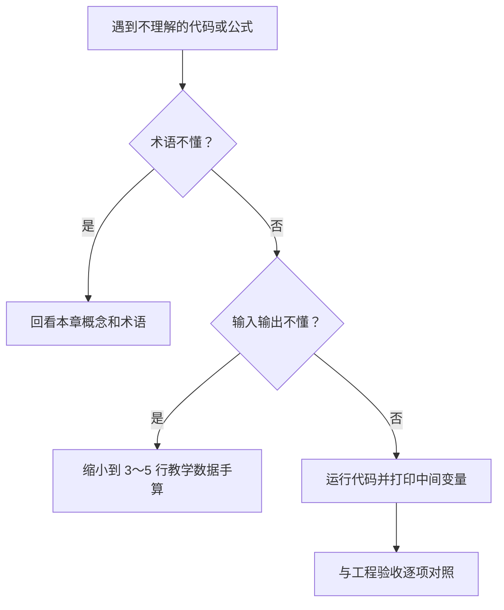

# 00 中国 A 股量化交易完整学习路线

> [!WARNING] 风险提示
> 本教程只用于金融知识、量化研究、历史回测和模拟盘教学，不构成投资建议，不承诺收益，也不连接真实券商。

## 这套教程解决什么问题

很多量化教程只讲指标公式，或者直接给出几百行代码，默认读者已经懂金融、Python 和回测偏差。本教程从零开始，把同一套教学数据沿着下面的路径逐层推进：

读图时从左向右看。每个方框的输出都是下一个方框的输入，不能从“出现信号”直接跳到“获得收益”。

## 学习前需要什么

- 会使用 Windows 文件资源管理器和浏览器即可。
- 不要求预先学习金融、概率统计、Python、数据库或前端。
- 数学推导先用具体数字手算，再给公式和代码。
- Python 项目独立放在 `quant-lab\`。
- Obsidian 笔记放在 `docs\`。

> [!IMPORTANT] 项目边界
> 后端全部使用 Python 3.12、FastAPI、Pandas、NumPy、SQLAlchemy、SQLite 和 pytest，不使用 Java。Vue 3 与 ECharts 只负责浏览器界面。

## 可点击目录

- [课程结构](#课程结构)
- [19 篇教程](#19-篇教程)
- [贯穿全书的教学数据](#贯穿全书的教学数据)
- [推荐学习方法](#推荐学习方法)
- [每个阶段的完成标准](#每个阶段的完成标准)
- [旧版章节怎样合并](#旧版章节怎样合并)

## 课程结构

| 阶段 | 章节 | 目标 |
|---|---:|---|
| 金融与工具基础 | 01～06 | 能读懂市场、收益、订单、Python 表格和数据库 |
| 数据与研究方法 | 07～10 | 能构造当时可知的数据，并把想法写成可检验规则 |
| 回测、策略与风控 | 11～16 | 能运行受 A 股约束的回测并识别过拟合 |
| 软件项目 | 17～18 | 能启动 Python 后端、网页和模拟盘并完成验收 |

## 19 篇教程

1. [00 中国 A 股量化交易完整学习路线](./00-完整教程索引与学习路线.md)
2. [01 金融体系与量化交易基础](./01-金融体系与量化交易基础.md)
3. [02 金融资产与中国 A 股市场](./02-金融资产与中国A股市场.md)
4. [03 A 股交易规则、订单、成交与成本](./03-A股交易规则订单成交与成本.md)
5. [04 金融数学、概率与统计基础](./04-金融数学概率与统计基础.md)
6. [05 Python 量化研究零基础](./05-Python量化研究零基础.md)
7. [06 Pandas、可视化与 SQL 数据管理](./06-Pandas可视化与SQL数据管理.md)
8. [07 A 股数据源、交易日历与点时股票池](./07-A股数据源交易日历与时点股票池.md)
9. [08 数据清洗、复权、公司行为与研究偏差](./08-行情清洗复权与研究偏差防控.md)
10. [09 基本面、宏观、行业与技术指标](./09-基本面宏观风格与技术指标分析.md)
11. [10 研究假设、信号、仓位与订单](./10-研究假设信号仓位与订单.md)
12. [11 手写向量化回测引擎](./11-手写向量化回测.md)
13. [12 事件驱动回测与 A 股约束](./12-事件驱动回测与A股交易约束.md)
14. [13 绩效评估、收益归因与过拟合](./13-绩效评估收益归因与过拟合防控.md)
15. [14 因子研究、组合构建与风险管理](./14-因子研究组合构建与风险管理.md)
16. [15 趋势、均值回归与基本面策略实战](./15-趋势均值回归与多因子实战.md)
17. [16 机器学习量化策略入门](./16-机器学习量化入门.md)
18. [17 Python 量化平台架构与 FastAPI](./17-Python量化平台架构数据库与API.md)
19. [18 前端、模拟盘、测试与综合实战](./18-Vue前端模拟盘测试与综合验收.md)

## 贯穿全书的教学数据

项目包含三只虚构证券，不对应真实投资建议：

| 代码 | 名称 | 教学用途 |
|---|---|---|
| 600001.SH | 华东制造教学股 | 主板、趋势与公司行为 |
| 000001.SZ | 南方银行教学股 | 银行基本面与停牌 |
| 300001.SZ | 创新科技教学股 | 创业板与高波动 |

行情范围是 2025-01-02 至 2025-01-17，共 12 个教学交易日。它足以手算和测试流程，不足以评价策略长期有效性。

## 推荐学习方法

每章执行六步：

1. 先读“现实问题”，用自己的话复述为什么需要本章。
2. 遇到公式先遮住答案手算，再运行 Python。
3. 运行完整示例前，逐行预测变量会怎样变化。
4. 对照实际输出，不一致时先查输入与日期。
5. 主动触发一个失败路径，阅读异常或拒单原因。
6. 闭卷完成自测题，再展开答案核对。

> [!WARNING] 回测陷阱
> 代码能运行只证明流程没有立刻崩溃。它不证明数据当时可知、价格能够成交、参数没有过拟合或策略未来会赚钱。

## 每个阶段的完成标准

### 完成 01～06 后

能解释股票与债券的差异，手算复利和回撤，读懂 Python 函数，使用 Pandas 计算滚动均线，并理解 SQL 唯一键。

### 完成 07～10 后

能回答“这条数据当时是否已经发布”，能处理停牌和公司行为，并把一句投资想法改写成包含基准、持有期、成本和拒绝条件的研究协议。

### 完成 11～16 后

能区分向量化和事件驱动回测，知道 T+1、涨跌停和费用如何改变结果，能使用样本外测试拒绝过拟合。

### 完成 17～18 后

能在 `quant-lab\` 启动纯 Python 后端，通过网页提交回测，查看净值、回撤、成交与模拟持仓，并运行自动化测试。

## 旧版章节怎样合并

| 新版 | 合并的旧版主题 |
|---|---|
| 01～04 | 原 01～06 的金融、市场、成本、数学和统计 |
| 05～06 | 原 07～10 的 Python、Pandas、图表与 SQL |
| 07～09 | 原 11～17 的数据、复权、偏差、财报与指标 |
| 10～13 | 原 18～25 的研究协议、回测、绩效和稳健性 |
| 14～16 | 原 26～32 的因子、组合、策略和机器学习 |
| 17～18 | 原 33～38 的平台、API、前端、模拟盘和测试 |

合并不是删掉知识点，而是让强依赖的概念在一章内形成“问题—方法—计算—代码—失败”的闭环。

## 下一步

进入 [01 金融体系与量化交易基础](./01-金融体系与量化交易基础.md)。第一章不急着看 K 线，而是先回答金融市场解决什么问题、量化交易到底量化了什么。

## 零基础使用法：每章分三遍学习

第一遍不要追求记忆公式，只回答“这章解决什么现实问题”。第二遍亲手输入代码，观察每个中间变量。第三遍关闭笔记，用自己的话复述并完成自测。

| 学习遍次 | 你要做什么 | 合格标准 |
|---|---|---|
| 第 1 遍 | 阅读现实问题、图和总结 | 能用三句话说明本章用途 |
| 第 2 遍 | 手算一个小例子并运行代码 | 程序结果与手算一致 |
| 第 3 遍 | 故意制造一个错误并排查 | 能解释错误原因和修复方法 |

### 不理解时如何回退

> [!IMPORTANT] 量化重点
> 不要跳过“失败路径”和“工程验收”。量化能力很大一部分来自发现结果为什么不可信，而不是只会生成结果。

### 全书统一记号

| 记号 | 含义 |
|---|---|
| $P_t$ | 第 $t$ 个时点的价格 |
| $r_t$ | 从 $t-1$ 到 $t$ 的收益率 |
| $w_t$ | 第 $t$ 个时点的组合权重 |
| $NAV_t$ | 第 $t$ 个时点的账户净值 |
| $i$ | 第 $i$ 只证券 |
| $t+1$ | 下一交易时点，不一定是下一个自然日 |

遇到其他符号时，先在本章公式前寻找定义；任何没有定义单位和时间的变量都不应直接进入策略。
