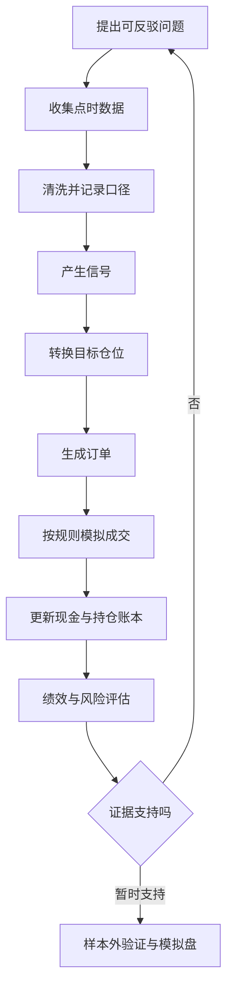
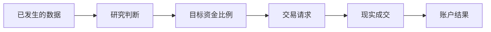

# 01 金融体系与量化交易基础

[上一章：完整学习路线](./00-完整教程索引与学习路线.md) ｜ [下一章：金融资产与 A 股市场](./02-金融资产与中国A股市场.md)

> [!NOTE] 学习目标
> 从零理解金融、投资、交易、收益与风险；能画出量化研究闭环；能说明回测盈利为什么不等于未来盈利。

## 学习定位

本章是全书的概念地基。你不需要金融知识，只需知道“今天的一元钱”和“未来的一元钱”可能具有不同价值。学完后，你应能判断一个说法是在描述事实、提出假设，还是承诺无法保证的未来结果。

## 可点击目录

- [从一个现实问题开始](#从一个现实问题开始)
- [金融系统在做什么](#金融系统在做什么)
- [投资投机和交易](#投资投机和交易)
- [量化交易到底量化什么](#量化交易到底量化什么)
- [完整研究闭环](#完整研究闭环)
- [收益和风险不能分开](#收益和风险不能分开)
- [读取第一份教学数据](#读取第一份教学数据)
- [常见误区与排错](#常见误区与排错)
- [本章总结](#本章总结)
- [自测题](#自测题)

## 从一个现实问题开始

假设你有 10,000 元闲置一年，可以选择存款、购买债券、购买股票或保留现金。每个选择都在交换三件事：

1. 现在能不能随时使用这笔钱；
2. 未来可能得到多少；
3. 未来结果有多不确定。

金融不是“研究股票涨跌”的同义词。它研究资金怎样跨时间流动、风险怎样在参与者之间转移，以及价格怎样协调不同人的决策。

## 金融系统在做什么

### 资金为什么需要流动

有些人暂时有多余资金，有些企业需要资金建设工厂。金融系统把两者连接起来。银行贷款、债券和股票都是连接方式，但权利不同：

- 贷款和债券通常约定偿还；
- 股票代表对公司剩余价值的权利；
- 保险把特定损失风险集中管理；
- 衍生品帮助转移价格风险，也可能放大杠杆。

> [!NOTE] 通俗类比
> 金融市场像一个大型资金交通系统。价格类似拥堵费，帮助资金决定走哪条路。类比的边界是，资金决策受信息不对称、制度和预期影响，并不像车辆路线那样确定。

### 一级市场与二级市场

一级市场是证券第一次发行给投资者的市场，资金通常流向融资者。二级市场是投资者之间买卖已有证券的市场。你在证券软件里买卖普通 A 股，大多发生在二级市场。

没有活跃二级市场，投资者更难退出，一级市场融资也会更困难。但“流动性更好”不代表“价格不会下跌”。

## 投资、投机和交易

| 概念 | 关注点 | 不代表什么 |
|---|---|---|
| 投资 | 未来现金流、资产价值与长期回报 | 买入后一定盈利 |
| 投机 | 对价格变化承担风险以争取收益 | 必然违法或毫无分析 |
| 交易 | 订单在市场中交换资产的行为 | 交易频繁就更专业 |
| 套利 | 利用可执行价格关系争取低风险收益 | 完全没有执行风险 |

区分这些词不是贴道德标签，而是明确收益来自哪里、需要承担什么风险。

## 量化交易到底量化什么

量化交易不是“让电脑自动赚钱”，而是把决策变成明确的数据和规则：

- 输入：价格、成交量、财报、行业、日历等；
- 处理：清洗、计算指标、模型估计；
- 输出：信号、目标仓位、订单；
- 约束：资金、风险、停牌、涨跌停、T+1、费用；
- 证据：成交、净值、回撤、日志和测试。

### 定量不等于客观无误

程序会忠实执行代码，但代码可能忠实执行错误假设：

- 数据使用了未来信息；
- 忽略无法成交的涨停或跌停；
- 在几十个参数中只展示最赚钱的一个；
- 把短期巧合当成长期规律。

> [!IMPORTANT] 量化重点
> 量化的价值首先是可重复、可检查、可反驳，其次才是提高处理速度。

## 完整研究闭环



注意信号和成交之间隔着仓位、订单和撮合。缺少其中任何一步，收益都可能是虚构的。

## 收益和风险不能分开

投入 10,000 元，期末变为 10,500 元：

$$
R=\frac{V_1-V_0}{V_0}
 =\frac{10500-10000}{10000}
 =5\%
$$

- $R$ 是收益率；
- $V_0$ 是期初价值；
- $V_1$ 是期末价值。

5% 只描述起点和终点。如果过程中先跌到 7,000 元再回升，投资者曾承受 30% 的损失。收益、波动、回撤和流动性必须一起看。

风险指结果偏离预期的可能性，尤其关注不利结果。高波动不等于一定亏损，低波动也不等于没有风险，例如长期停牌或流动性枯竭。

## 读取第一份教学数据

先进入项目并安装依赖：

```powershell
Set-Location <仓库目录>\quant-lab
py -3.12 -m venv .venv
.\.venv\Scripts\Activate.ps1
python -m pip install -e ".[dev]"
```

首次代码只读取证券主数据：

```python
from pathlib import Path
import pandas as pd

path = Path("E:/Study/quant-lab/data/instruments.csv")
instruments = pd.read_csv(path)

print(instruments[["symbol", "name", "exchange", "board"]])
print("证券数量：", len(instruments))
```

`Path` 表示文件路径，`read_csv` 把逗号分隔文件读成表格，双中括号选择列，`len` 返回行数。输出会看到三只名称含“教学股”的证券。这证明文件可读，不证明证券值得投资。

## 常见误区与排错

### 历史回测盈利就是发现规律

历史只有一条已发生路径。策略可能只是适应这条路径，需要样本外、滚动验证和模拟盘。

### 自动化等于高频交易

每天收盘计算一次信号也可以自动化。高频交易涉及更高申报频率、系统和监管要求，不是量化唯一形态。

### 模型越复杂越好

复杂模型能表达更多关系，也更容易拟合噪声。任何复杂模型都应与简单基线比较。

### 找不到文件

依次检查：

1. 当前目录是否为 `quant-lab\`；
2. `data\instruments.csv` 是否存在；
3. 路径是否混用了中文引号；
4. 是否误把笔记目录当成项目目录。

> [!WARNING] 风险提示
> 不要在教程阶段加入真实账户、密码或券商接口。先把数据正确性和模拟账本做好。

## 本章总结

- 金融系统连接跨时间的资金与风险。
- 投资、投机和交易关注点不同，但都不能绕过风险。
- 量化交易把输入、规则、订单、成交和评估变成可检查流程。
- 收益率只描述价值变化，不描述完整风险路径。
- 代码能运行不等于策略有效。

## 自测题

1. 一级市场和二级市场分别解决什么问题？
2. 为什么出现买入信号不能直接把持仓加 100 股？
3. 10,000 元变为 9,000 元后，需要上涨多少才能回到 10,000 元？
4. 量化方法最先带来的价值是什么？

<details>
<summary>展开参考答案</summary>

1. 一级市场完成新证券发行和融资，二级市场让已有证券在投资者之间转让并提供流动性。
2. 信号只是判断，还要经过目标仓位、订单校验、撮合和成交。
3. 需要上涨 $(10000-9000)/9000=11.11\%$。
4. 首先是决策可重复、可检查和可反驳，而不是自动盈利。

</details>

## 零基础慢速推演：一次量化决策究竟发生了什么

假设你在 1 月 5 日收盘后发现教学股票 A 的短期均线高于长期均线：

1. 行情数据只说明截至 1 月 5 日已经发生的价格。
2. 策略把该状态转成 `Signal(score=1)`。
3. 组合模块结合现金和风险限制，决定目标权重 20%。
4. 订单模块根据下一日价格、整手和费用估算数量。
5. 1 月 6 日开盘若没有停牌和成交限制，模拟器才可能生成成交。
6. 账户账本减少现金、增加持仓。
7. 后续收益由实际持仓获得，不是信号本身获得。



### 输入、处理、输出

| 环节 | 输入 | 处理 | 输出 |
|---|---|---|---|
| 研究 | 历史可见数据 | 公式或模型 | Signal |
| 组合 | Signal、权益、风险限制 | 仓位规则 | TargetPosition |
| 执行 | 目标与市场状态 | 校验和撮合 | Fill 或拒绝 |
| 账本 | Fill、公司行为、价格 | 现金和持仓记账 | PortfolioSnapshot |

> [!CAUTION] 回测陷阱
> 如果程序从“看到收盘价”直接跳到“按同一收盘价持仓”，中间缺失的时间与执行环节会制造不可能的收益。

### 学习检查

请不用术语复述：量化交易不是让计算机预测未来，而是把哪些步骤变得明确？合格回答应包含数据、规则、执行、记录和检验。
