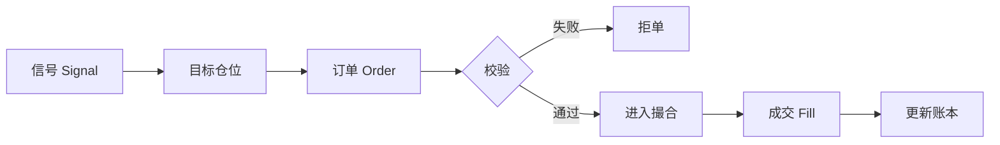
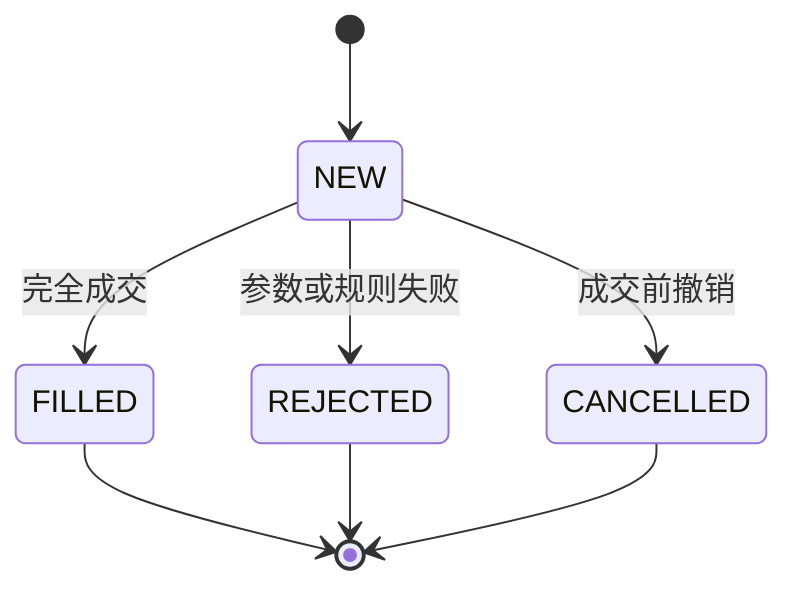

# 03 A 股交易规则、订单、成交与成本

[上一章：金融资产与市场](./02-金融资产与中国A股市场.md) ｜ [下一章：金融数学与统计](./04-金融数学概率与统计基础.md)

> [!NOTE] 学习目标
> 理解竞价、订单、成交、持仓、T+1、停牌、涨跌停和交易成本；能手算一次买卖的现金变化；能运行 MockBroker 的拒单与成交示例。

## 可点击目录

- [信号为什么不等于成交](#信号为什么不等于成交)
- [交易日与竞价阶段](#交易日与竞价阶段)
- [订单怎样变成成交](#订单怎样变成成交)
- [A 股关键约束](#a-股关键约束)
- [交易成本完整计算](#交易成本完整计算)
- [订单状态机](#订单状态机)
- [运行模拟券商](#运行模拟券商)
- [规则来源与排错](#规则来源与排错)
- [本章总结](#本章总结)
- [自测题](#自测题)

## 信号为什么不等于成交

策略说“买入 100 股”只是决策意图。真实链路是：



信号没有修改账户的权力。只有成交才能改变现金和持仓。

## 交易日与竞价阶段

交易所不是每天全天连续交易，需要区分交易日、休市日、集合竞价、连续竞价、收盘集合竞价和临时停牌。

**集合竞价**把一段时间内的申报集中起来确定成交价。**连续竞价**按照价格优先、时间优先逐笔撮合。

> [!WARNING] 常见误区
> 日线只有开高低收，无法重建完整订单簿。日线回测只能使用明确标注的简化成交模型。

## 订单怎样变成成交

| 字段 | 例子 | 用途 |
|---|---|---|
| 证券代码 | 600001.SH | 确定交易对象 |
| 买卖方向 | BUY | 确定现金与持仓变化方向 |
| 数量 | 100 | 校验整手和可卖数量 |
| 限价 | 10.20 | 限制最差可接受价格 |
| 交易日期 | 2025-01-02 | 应用日历和 T+1 |
| 状态 | NEW | 追踪生命周期 |

限价买单表示“价格不高于限价时才愿意买”，并不保证成交。价格达到涨停时，也可能因为卖单不足而买不到。

## A 股关键约束

### T+1 可卖数量

教学模型中，当日买入 100 股：

- `quantity=100`：账户已经持有；
- `sellable_quantity=0`：当日不可卖；
- 日终结算后，`sellable_quantity=100`。

持仓数量与可卖数量不是同一个字段。

### 整手与申报数量

教学模型把买入数量限制为 100 股的正整数倍。真实规则按证券类型和现行文件核验，不要推广到所有基金、债券和特殊交易。

### 停牌与涨跌停

停牌日没有正常交易，不能使用旧价格假装成交。价格达到涨跌停限制只说明价格边界，不说明对手盘足够。教学撮合采取保守规则：

- 开盘价达到涨停价时不模拟买入；
- 开盘价达到跌停价时不模拟卖出。

## 交易成本完整计算

以 10 元买 100 股，成交额：

$$
A=10\times100=1000\text{ 元}
$$

教学佣金率 0.03%，最低 5 元：

$$
C=\max(1000\times0.0003,5)=5\text{ 元}
$$

买入后现金减少 1,005 元。以后以 11 元卖出，教学卖出税率 0.05%：

$$
\begin{aligned}
A_s &=11\times100=1100\\
C_s &=\max(1100\times0.0003,5)=5\\
T_s &=1100\times0.0005=0.55\\
\text{到账} &=1100-5-0.55=1094.45
\end{aligned}
$$

完整往返净盈利为 $1094.45-1005=89.45$ 元。毛盈利 100 元，成本侵蚀 10.55 元。实际税费须按账户和核验日期更新。

## 订单状态机



成交、拒单和撤单是不同事实。不能把拒单写成持仓，也不能在成交后把订单改成“未发生”。

## 运行模拟券商

```python
from datetime import date

from quant_lab.core.models import Bar, Side
from quant_lab.paper.broker import MockBroker

bar = Bar(
    trading_date=date(2025, 1, 2),
    symbol="600001.SH",
    open=10.0,
    high=10.3,
    low=9.9,
    close=10.2,
    volume=120_000,
    limit_up=11.0,
    limit_down=9.0,
)

broker = MockBroker(cash=100_000)
invalid = broker.submit(bar.symbol, Side.BUY, 50, bar.trading_date)
print(invalid.status, invalid.reject_reason)

buy = broker.submit(bar.symbol, Side.BUY, 100, bar.trading_date)
fill = broker.match(buy, bar)
print(fill)
print("现金：", broker.cash)
print("持仓：", broker.positions[bar.symbol])
```

预期：50 股被拒；100 股成交；现金扣除成交额与佣金；持仓为 100，可卖数量为 0。

## 规则来源与排错

核验日期为 2026-07-17。上交所、深交所和北交所都在 2026-04-24 发布了修订交易规则，除另有衔接安排的条款外自 2026-07-06 起施行；其中部分条文可能暂缓实施，不能只看到“2026 年修订”就假设全部功能已经生效。

- [上交所交易规则（2026 年修订）](https://www.sse.com.cn/lawandrules/sselawsrules2025/stocks/exchange/c/c_20260424_10816482.shtml)
- [深交所交易规则（2026 年修订）](https://www.szse.cn/lawrules/rule/allrules/bussiness/t20260424_620190.html)
- [北交所交易规则](https://www.bse.cn/jygl_list/200028217.html)
- [证监会《证券市场程序化交易管理规定（试行）》](https://www.csrc.gov.cn/csrc/c101954/c7480579/content.shtml)：自 2024-10-08 起施行。
- [中国结算上海市场收费与代收税费表](https://www.chinaclear.cn/zdjs/fbzyls/202506/9d22b74d9f2e40edb67b44d1f6596f18/files/%E4%B8%8A%E6%B5%B7%E5%B8%82%E5%9C%BA%E8%AF%81%E5%88%B8%E7%99%BB%E8%AE%B0%E7%BB%93%E7%AE%97%E4%B8%9A%E5%8A%A1%E6%94%B6%E8%B4%B9%E5%8F%8A%E4%BB%A3%E6%94%B6%E7%A8%8E%E8%B4%B9%E4%B8%80%E8%A7%88%E8%A1%A8.pdf)
- [中国结算深圳市场收费与代收税费表](https://www.chinaclear.cn/zdjs/fbzyls/202506/ab6384ba25514554a7eceaee3e521032/files/%E6%B7%B1%E5%9C%B3%E5%B8%82%E5%9C%BA%E8%AF%81%E5%88%B8%E7%99%BB%E8%AE%B0%E7%BB%93%E7%AE%97%E4%B8%9A%E5%8A%A1%E6%94%B6%E8%B4%B9%E5%8F%8A%E4%BB%A3%E6%94%B6%E7%A8%8E%E8%B4%B9%E4%B8%80%E8%A7%88%E8%A1%A8.pdf)

本章 `0.03% 且最低 5 元` 的佣金是教学账户假设，不是交易所统一报价。中国结算上述表格在检索时标注为 2025-06-30 更新；软件仍把税费和费率做成带核验日期的配置，并在每次正式研究前重新查询最新版本。

> [!NOTE] A 股规则
> 教学回测不代表获得真实程序化交易资格。规则、费率和接口在实盘前必须重新核验。

| 现象 | 优先检查 |
|---|---|
| 现金没有减少 | 订单是否真正 FILLED |
| 当日买入又卖出 | sellable_quantity 是否错误 |
| 50 股买单成交 | 整手校验是否绕过 |
| 涨停仍买入 | 是否比较 limit_up |
| 成本为 0 | 最低佣金和卖出税 |
| 停牌有成交 | is_suspended 是否先检查 |

## 本章总结

- 信号、订单、成交和持仓是不同对象。
- T+1 要同时记录持仓与可卖数量。
- 停牌与涨跌停会阻止理论订单成交。
- 成本必须逐笔进入现金账本。
- 市场规则要带核验日期。

## 自测题

1. 限价买单为 10 元、开盘 10.2 元，应怎样处理？
2. 当日买入 100 股后，quantity 与 sellable_quantity 分别是多少？
3. 为什么涨停价不等于一定可以买到？
4. 订单被拒后，现金和持仓应怎样变化？

<details>
<summary>展开参考答案</summary>

1. 不成交，因为买方不接受高于 10 元的价格。
2. quantity=100，sellable_quantity=0。
3. 仍需卖方申报，价格边界不能证明对手盘存在。
4. 都不变化，只记录拒单原因。

</details>

## 零基础账本推演：一买一卖怎样影响现金

初始现金 10000 元，买入 100 股，成交价 10 元，买入佣金 5 元：

$$
Cash_{after\ buy}=10000-100\times10-5=8995
$$

下一交易日以 10.50 元卖出，佣金 5 元，教学税费 0.525 元：

$$
Cash_{after\ sell}=8995+100\times10.5-5-0.525=10039.475
$$

净利润：

$$
Profit=10039.475-10000=39.475
$$

若只看买卖价差，毛利润是 50 元；费用拖累为 10.525 元。

```python
initial_cash = 10_000.0
quantity = 100
buy_price = 10.0
sell_price = 10.5
buy_commission = 5.0
sell_commission = 5.0
sell_tax = 0.525

cash = initial_cash - quantity * buy_price - buy_commission
cash += quantity * sell_price - sell_commission - sell_tax
assert abs(cash - 10_039.475) < 1e-9
```

> [!IMPORTANT] 量化重点
> 每次 Fill 都必须同时更新现金和持仓；费用属于成交事实，不能等回测结束后只从总收益里随意减一个比例。

### 订单失败时逐项问

1. 数量是否为正且满足申报单位？
2. 现金是否覆盖成交额与费用？
3. 卖出是否超过可卖数量？
4. 当日是否停牌？
5. 限价是否允许按当前模拟价成交？
6. 是否触发保守涨跌停模型？

把拒绝原因保存在订单上，才能区分“策略不想交易”和“策略想交易但市场不允许”。
