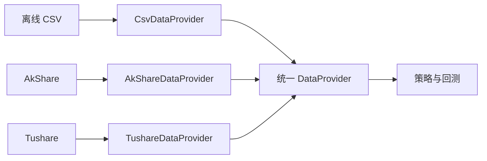

# 07｜A 股数据源、交易日历与时点股票池

> [!WARNING] 风险提示
> 本章数据与代码只用于教学研究，不构成投资建议。真实使用前必须核对数据授权、字段含义、更新时间与官方市场规则。

## 学习目标

学完本章，你应当能够：

1. 区分证券主数据、交易日历、行情、公司行为和财务数据。
2. 用统一接口隔离 CSV、AkShare、Tushare 等不同来源。
3. 构造“某个历史日期当时真实存在”的股票池。
4. 解释为什么今天的成分股名单不能直接用于历史回测。
5. 为数据缓存、来源日期和授权边界建立记录。

## 前置知识

- 已学习 [第 05 章 Python 基础](./05-Python量化研究零基础.md)。
- 已学习 [第 06 章 Pandas 与 SQL](./06-Pandas可视化与SQL数据管理.md)。
- 会把 CSV 读成 DataFrame，并理解日期排序。

## 目录

- [1. 先认识五类数据](#1-先认识五类数据)
- [2. 为什么需要统一数据接口](#2-为什么需要统一数据接口)
- [3. 证券主数据与交易日历](#3-证券主数据与交易日历)
- [4. 时点股票池](#4-时点股票池)
- [5. 财务数据的可得日期](#5-财务数据的可得日期)
- [6. 本地 CSV 数据提供器](#6-本地-csv-数据提供器)
- [7. 缓存、追溯与授权](#7-缓存追溯与授权)
- [8. 常见失败与排错](#8-常见失败与排错)
- [9. 本章验收](#9-本章验收)

## 1. 先认识五类数据

量化研究不是“下载一张收盘价表”这么简单。一个最小但严谨的数据层至少包含：

| 数据类型 | 回答的问题 | 典型字段 |
|---|---|---|
| 证券主数据 | 它是谁、何时存在、属于哪里 | 代码、交易所、上市日、退市日、板块 |
| 交易日历 | 某日是否交易 | 日期、是否开市、前后交易日 |
| 行情数据 | 某时段市场如何报价成交 | OHLC、成交量、成交额 |
| 公司行为 | 股本或现金权益如何变化 | 分红、送股、转增、配股 |
| 财务数据 | 企业经营与资产状况如何 | 营收、净利润、净资产、公告日 |

> [!IMPORTANT] 量化重点
> 任何一条研究数据都应能回答四个问题：它描述什么、属于哪个时间、何时能被研究者知道、来自哪里。

### 一条数据的四个时间

以年报净利润为例，至少可能出现：

- `period_end`：报表覆盖期末，例如 2025-12-31。
- `announcement_date`：公司正式公告日。
- `available_date`：你的数据源中实际可使用的日期。
- `ingested_at`：数据被导入本地系统的时间。

回测只能在 `available_date` 当日或之后使用该记录，不能因为 `period_end` 更早就提前使用。

## 2. 为什么需要统一数据接口

不同数据源的代码格式、字段名称、复权定义和限频规则都可能不同。如果策略直接依赖供应商字段，换源时整个项目都要重写。



统一接口应输出项目自己的领域对象或标准 DataFrame：

```python
from typing import Protocol
import pandas as pd

class DataProvider(Protocol):
    def instruments(self, as_of: str | None = None) -> pd.DataFrame:
        ...

    def trading_calendar(self, start: str, end: str) -> pd.DataFrame:
        ...

    def bars(
        self,
        symbols: list[str],
        start: str,
        end: str,
    ) -> pd.DataFrame:
        ...

    def fundamentals(
        self,
        symbols: list[str],
        available_before: str,
    ) -> pd.DataFrame:
        ...
```

> [!TIP] 工程验收
> 把离线 CSV 提供器换成联网适配器时，策略函数和回测器不需要修改。

## 3. 证券主数据与交易日历

### 3.1 证券身份

“600000”不是足够明确的证券身份。建议内部统一为带交易所后缀的代码：

- `600000.SH`：上海证券交易所。
- `000001.SZ`：深圳证券交易所。
- `830799.BJ`：北京证券交易所。

最小证券表可以包含：

| 字段 | 示例 | 用途 |
|---|---|---|
| symbol | 600000.SH | 唯一标识 |
| name | 教学银行 A | 展示 |
| exchange | SSE | 规则选择 |
| board | main | 板块规则选择 |
| list_date | 1999-11-10 | 判断是否已上市 |
| delist_date | 空 | 判断是否已退市 |
| lot_size | 100 | 订单数量校验 |

不要用简称做主键，因为简称可能改变或重名。

### 3.2 交易日历

自然日不等于交易日。周末、节假日和临时休市都可能没有交易。

```python
import pandas as pd

calendar = pd.DataFrame({
    "date": pd.to_datetime([
        "2026-01-05", "2026-01-06", "2026-01-07"
    ]),
    "is_open": [True, True, True],
})

open_days = calendar.loc[calendar["is_open"], "date"]
previous_day = open_days[open_days < pd.Timestamp("2026-01-07")].max()
print(previous_day.date())
```

预期输出：

```text
2026-01-06
```

周一的前一个自然日是周日，但前一个交易日通常是周五。所有“前一日收盘”“持有 N 日”“下一交易日成交”都必须依据交易日历。

> [!IMPORTANT] A 股规则
> 交易时间、节假日安排和临时休市应记录核验日期并以交易所公告为准，不要把自然日规则写死在策略里。

## 4. 时点股票池

股票池是某个日期可供策略选择的证券集合，它必须随时间变化。

在日期 $t$，证券 $i$ 至少需要满足：

$$
list\_date_i \le t
$$

并且：

$$
delist\_date_i \text{ 为空，或 } t < delist\_date_i
$$

```python
import pandas as pd

def point_in_time_universe(instruments: pd.DataFrame, as_of: str) -> pd.DataFrame:
    date = pd.Timestamp(as_of)
    data = instruments.copy()
    data["list_date"] = pd.to_datetime(data["list_date"])
    data["delist_date"] = pd.to_datetime(data["delist_date"], errors="coerce")

    listed = data["list_date"] <= date
    not_delisted = data["delist_date"].isna() | (date < data["delist_date"])
    return data.loc[listed & not_delisted].copy()
```

还可能需要按历史日期过滤：

- 当日是否 ST 或 *ST。
- 当日是否停牌。
- 是否处于上市初期。
- 当日是否属于目标指数。
- 过去一段时间是否满足流动性门槛。

这些状态不能只保存“当前值”，而应保存有效起止日期。

### 幸存者偏差的小例子

假设 2020 年有 A、B、C 三只股票，C 在 2023 年退市。若在 2026 年下载“当前上市股票”，C 已消失。用这份名单回测 2020 年，相当于提前知道 C 会失败，结果通常被美化。

> [!CAUTION] 回测陷阱
> 使用当前成分股回测历史，是最常见的幸存者偏差之一。股票池必须按历史日期重建。

## 5. 财务数据的可得日期

下面记录在 2026-03-25 公告：

| period_end | net_profit | announcement_date | available_date |
|---|---:|---|---|
| 2025-12-31 | 120000000 | 2026-03-25 | 2026-03-26 |

在 2026-03-24 的策略中，这条数据不可见，即使它描述的是 2025 年。

```python
def visible_fundamentals(df: pd.DataFrame, decision_date: str) -> pd.DataFrame:
    data = df.copy()
    data["available_date"] = pd.to_datetime(data["available_date"])
    return data[data["available_date"] <= pd.Timestamp(decision_date)]
```

若数据源没有 `available_date`，可以保守使用官方公告日再加系统处理延迟，但必须把假设写进研究报告。

## 6. 本地 CSV 数据提供器

教程项目位于 `quant-lab`，默认数据放在 `data`，断网也能运行。

```python
from pathlib import Path
import pandas as pd

class CsvDataProvider:
    def __init__(self, data_dir: str | Path):
        self.data_dir = Path(data_dir)

    def instruments(self, as_of: str | None = None) -> pd.DataFrame:
        df = pd.read_csv(
            self.data_dir / "instruments.csv",
            dtype={"symbol": "string"},
        )
        if as_of is None:
            return df
        return point_in_time_universe(df, as_of)

    def bars(self, symbols: list[str], start: str, end: str) -> pd.DataFrame:
        df = pd.read_csv(
            self.data_dir / "bars.csv",
            parse_dates=["date"],
            dtype={"symbol": "string"},
        )
        mask = (
            df["symbol"].isin(symbols)
            & df["date"].between(pd.Timestamp(start), pd.Timestamp(end))
        )
        return df.loc[mask].sort_values(["symbol", "date"]).reset_index(drop=True)

provider = CsvDataProvider(r"data")
universe = provider.instruments("2025-01-10")
bars = provider.bars(
    symbols=universe["symbol"].tolist(),
    start="2025-01-01",
    end="2025-01-10",
)
print(universe[["symbol", "exchange"]])
print(bars.head())
```

数据提供器负责字段映射、类型标准化、统一异常、缓存与来源元数据。策略只负责依据历史可见数据生成信号，不应知道数据来自 CSV 还是网络。

## 7. 缓存、追溯与授权

每次数据快照建议记录：

```yaml
dataset: daily_bars_sample
source: offline-teaching-data
retrieved_at: 2026-07-17
schema_version: 1
adjustment: raw
license: teaching-only
sha256: example-placeholder
```

缓存键至少包含数据源、证券、起止日期、频率、复权方式和接口版本，否则前复权日线与不复权日线可能互相覆盖。

联网适配器还需处理：

- 访问令牌不能写入 Git。
- 请求限频与退避重试。
- 分页是否完整。
- 接口返回空表与真正无行情的区别。
- 供应商修改字段后的模式校验。

## 8. 常见失败与排错

### 证券代码前导零消失

现象：`000001.SZ` 读成数字后变成 `1`。读取时显式指定 `dtype={"symbol": "string"}`。

### 日期比较报类型错误

入口统一执行 `pd.to_datetime`，并检查时区与日频语义。

### 同一天同一证券出现两行

```python
duplicates = bars.duplicated(["symbol", "date"], keep=False)
print(bars.loc[duplicates])
```

不要直接丢弃，先确认是重复抓取、多个市场、不同频率还是供应商修订。

### 历史回测股票数量异常稳定

可能使用了今天的静态名单。检查上市、退市、ST 和指数成分的有效日期。

### 财务因子异常优秀

优先检查是否按报告期末对齐，而没有按公告日或可得日对齐。

## 9. 本章验收

> [!TIP] 工程验收
> 1. 能查询指定历史日期的可交易股票池。
> 2. 数据按证券与日期唯一、升序排列。
> 3. 财务记录不会早于可得日期进入策略。
> 4. 更换数据提供器不修改策略。
> 5. 每个数据快照都有来源、日期、模式版本和复权说明。

## 本章总结

数据层的核心不是“多”，而是“在正确的时间，以一致的含义提供可追溯的数据”。证券主数据决定谁存在，交易日历决定何时交易，可得日期决定研究者何时真正知道信息。

## 自测题

1. 为什么今天的沪深 300 成分股不能直接用于 2018 年回测？
2. `period_end` 和 `available_date` 有何区别？
3. 为什么策略层不应直接使用第三方接口字段？
4. 一个历史股票池至少需要哪些日期字段？

<details>
<summary>展开参考答案</summary>

1. 成分会调整，今天名单会排除后来退市或被调出的证券，引入幸存者偏差。
2. 前者是报告覆盖期末，后者是数据真正能被策略使用的日期。
3. 会让策略与供应商强耦合，字段变化或换源时必须重写策略。
4. 至少有上市日期和退市日期；严谨实现还需 ST、停牌、指数成分等状态的有效区间。

</details>

## 下一章

下一章处理复权、停牌、缺失和研究偏差：[第 08 章 行情清洗、复权与研究偏差防控](./08-行情清洗复权与研究偏差防控.md)。

## 贯穿案例检查点：重建一个历史决策日

选择教学数据中的某个日期 $t$，按顺序打印：

```python
decision_date = "2025-01-10"
universe = provider.instruments(decision_date)
bars = provider.bars(
    universe["symbol"].tolist(),
    start=decision_date,
    end=decision_date,
)

print("历史股票池数量:", len(universe))
print("当日有行情数量:", bars["symbol"].nunique())
print("股票池但无行情:", sorted(set(universe["symbol"]) - set(bars["symbol"])))
```

对“股票池但无行情”的证券逐一判断：停牌、数据失败，还是接口范围问题。不要直接把它们删除后继续。

> [!TIP] 工程验收
> 给定同一数据快照和历史日期，股票池结果完全一致；输出同时记录查询时点和快照版本。
