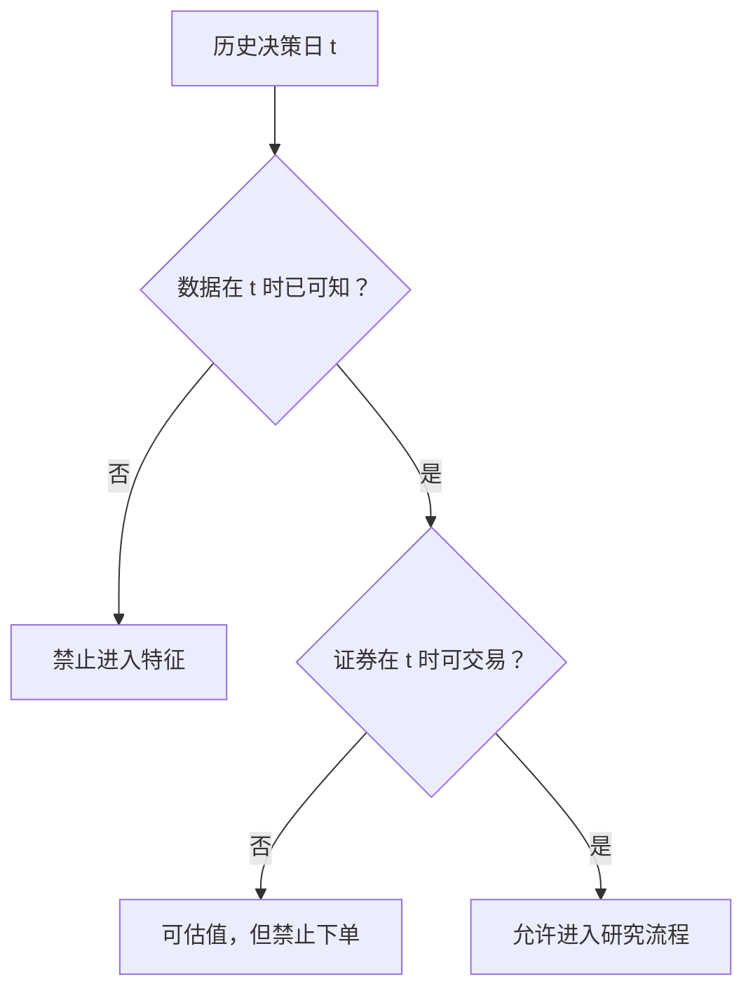

# 08｜行情清洗、复权与研究偏差防控

> [!WARNING] 风险提示
> 清洗规则会直接改变回测结果。必须保留原始数据、清洗代码、异常记录和复权口径，不能只保存处理后的净值曲线。

## 学习目标

1. 检查 OHLC、成交量、重复行和日期顺序。
2. 区分缺失、停牌、无成交和抓取失败。
3. 理解公司行为为何造成价格断点，并区分前复权、后复权和不复权。
4. 识别未来函数、前视偏差、数据泄漏和幸存者偏差。
5. 建立“输入数据不晚于决策时点”的时间审计。

## 前置知识

- [第 07 章](./07-A股数据源交易日历与时点股票池.md)的数据分类、交易日历和可得日期。
- Pandas 的排序、分组、缺失值和滚动计算。

## 目录

- [1. 原始行情为何不能直接回测](#1-原始行情为何不能直接回测)
- [2. OHLCV 一致性检查](#2-ohlcv-一致性检查)
- [3. 缺失值与停牌](#3-缺失值与停牌)
- [4. 公司行为与复权](#4-公司行为与复权)
- [5. 四类高危偏差](#5-四类高危偏差)
- [6. 可运行的清洗管线](#6-可运行的清洗管线)
- [7. 时间可见性审计](#7-时间可见性审计)
- [8. 失败路径与排错](#8-失败路径与排错)
- [9. 工程验收](#9-工程验收)

## 1. 原始行情为何不能直接回测

常见原始问题包括：

- 同一证券同一交易日重复。
- 日期逆序或混入非交易日。
- 最高价低于开盘价。
- 成交量为负数。
- 停牌日被误填为上一日价格。
- 分红送股后价格跳变却被误判为暴跌。
- 某些证券整段缺失。

稳健流程如下：


> [!IMPORTANT] 量化重点
> 清洗不是“把异常删掉”，而是识别异常、解释原因、记录决策，并让同一代码重复运行得到相同结果。

## 2. OHLCV 一致性检查

对普通日 K 线，通常应满足：

$$
high_t \ge \max(open_t, close_t, low_t)
$$

$$
low_t \le \min(open_t, close_t, high_t)
$$

且成交量和成交额通常不为负：

$$
volume_t \ge 0,\quad amount_t \ge 0
$$

```python
import pandas as pd

def find_ohlcv_issues(df: pd.DataFrame) -> pd.DataFrame:
    required = {"symbol", "date", "open", "high", "low", "close", "volume"}
    missing = required - set(df.columns)
    if missing:
        raise ValueError(f"缺少字段: {sorted(missing)}")

    flags = pd.DataFrame(index=df.index)
    flags["duplicate"] = df.duplicated(["symbol", "date"], keep=False)
    flags["bad_high"] = df["high"] < df[["open", "close", "low"]].max(axis=1)
    flags["bad_low"] = df["low"] > df[["open", "close", "high"]].min(axis=1)
    flags["negative_volume"] = df["volume"] < 0
    return df.loc[flags.any(axis=1)].copy()
```

发现异常后的顺序：

1. 回到原始快照核对。
2. 与第二数据源或交易所记录交叉验证。
3. 能修复时记录修复规则。
4. 无法确认时隔离该行或区间。
5. 在研究报告中说明影响。

用均值替换异常价格会制造不存在的成交路径。

## 3. 缺失值与停牌

### 3.1 四种“没有价格”

| 情况 | 含义 | 常见处理 |
|---|---|---|
| 周末或节假日 | 市场未开 | 不生成交易行 |
| 股票停牌 | 市场开，但该股票不可交易 | 保留状态，禁止成交 |
| 未上市或已退市 | 不在当时股票池 | 排除 |
| 数据抓取失败 | 本应有数据却缺失 | 报错、重抓或隔离 |

> [!IMPORTANT] A 股规则
> 停牌不是零收益的同义词。估值时可以按系统规则沿用最近可得价格，但交易模拟必须禁止停牌证券成交。

### 3.2 为什么不能无脑前向填充

```python
filled_close = bars.groupby("symbol")["close"].ffill()
```

画图时这可能方便，但若用于撮合，会让策略在停牌日按虚构价格买卖。应同时保存 `is_trading` 或 `is_suspended` 状态：

```python
bars["valuation_close"] = bars.groupby("symbol")["close"].ffill()
bars["can_trade"] = bars["is_open"] & ~bars["is_suspended"]
```

`valuation_close` 用于估值不代表 `can_trade=True`。

## 4. 公司行为与复权

### 4.1 现金分红的断点

假设除息前收盘价 10 元，每股现金分红 1 元。忽略波动，除息参考价可能接近 9 元。

不复权价格收益：

$$
\frac{9}{10}-1=-10\%
$$

但投资者还收到 1 元现金，总财富约为：

$$
9+1=10
$$

所以经济意义上的总收益并非 -10%。

### 4.2 三种价格口径

| 口径 | 特点 | 常见用途 |
|---|---|---|
| 不复权 | 保留历史真实报价 | 撮合、涨跌停判断、订单价格 |
| 前复权 | 当前价接近真实现价，向过去调整 | 连续图形、部分指标 |
| 后复权 | 保持早期价格，向未来累积调整 | 长期总收益研究 |

> [!IMPORTANT] 量化重点
> 信号可以使用口径明确的复权序列；成交与规则判断通常需要当时真实未复权价格。不要只保留一列含义不明的 `close`。

设原始价格为 $P_t$、累计复权因子为 $F_t$，一种通用表示是：

$$
P_t^{adj}=P_t \times F_t
$$

```python
bars["adjusted_close"] = bars["close"] * bars["adjustment_factor"]
```

不同供应商对 $F_t$ 的基准方向可能不同，必须阅读字段定义。

### 4.3 复权自检

- 除权除息日前后，调整序列是否在经济意义上连续。
- 最新日期的前复权价是否与约定基准一致。
- 新增公司行为后，历史前复权值是否改变。
- 撮合是否仍用真实报价。
- 现金分红是否进入账户账本。

## 5. 四类高危偏差

### 5.1 未来函数

决策日 $t$ 使用了 $t$ 之后的数据：

```python
#错误：center=True 会让窗口包含未来值
future_mean = close.rolling(5, center=True).mean()
```

### 5.2 前视偏差

研究设计使用当时未知的事后状态，例如用年末行业分类回填全年。

### 5.3 数据泄漏

先对全样本标准化再切训练集与测试集：

```python
#错误示意：均值和标准差已经看到了测试期
scaled = (features - features.mean()) / features.std()
train = scaled.loc[:"2024-12-31"]
test = scaled.loc["2025-01-01":]
```

正确做法是在训练集拟合均值、方差或模型参数，再应用到测试集。

### 5.4 幸存者偏差

历史样本只保留今天仍存在的公司，失败者被事后删除。



> [!CAUTION] 回测陷阱
> “代码没有显式读取未来行”不等于没有泄漏。全样本归一化、当前成分股、事后修订值和错误公告日同样会泄漏。

## 6. 可运行的清洗管线

```python
from pathlib import Path
import pandas as pd

def clean_bars(path: str | Path) -> tuple[pd.DataFrame, pd.DataFrame]:
    raw = pd.read_csv(
        path,
        dtype={"symbol": "string"},
        parse_dates=["date"],
    )

    numeric = ["open", "high", "low", "close", "volume"]
    for column in numeric:
        raw[column] = pd.to_numeric(raw[column], errors="coerce")

    raw = raw.sort_values(["symbol", "date"]).reset_index(drop=True)
    duplicate = raw.duplicated(["symbol", "date"], keep=False)
    invalid_ohlc = (
        (raw["high"] < raw[["open", "close", "low"]].max(axis=1))
        | (raw["low"] > raw[["open", "close", "high"]].min(axis=1))
        | (raw["volume"] < 0)
    )
    missing_price = raw[["open", "high", "low", "close"]].isna().any(axis=1)

    issue_mask = duplicate | invalid_ohlc | missing_price
    issues = raw.loc[issue_mask].copy()
    clean = raw.loc[~issue_mask].copy()

    if clean.duplicated(["symbol", "date"]).any():
        raise AssertionError("清洗后仍有重复键")
    return clean, issues

clean, issues = clean_bars(r"data\bars.csv")
print(f"可用行数: {len(clean)}, 隔离行数: {len(issues)}")
```

这段程序把可疑行放进 `issues`，没有静默删除。正式项目还应记录原因、处理人、时间和数据版本。

## 7. 时间可见性审计

对决策时点 $t$，特征依赖数据的最大可得时间必须满足：

$$
\max(available\_time\ of\ inputs) \le t
$$

如果使用 $t$ 日收盘数据计算信号，常见执行顺序是：

```text
t 日收盘完成
    ↓
t 日行情变为可见
    ↓
计算信号与目标仓位
    ↓
t+1 交易日提交或撮合
```

```python
def assert_point_in_time(df: pd.DataFrame) -> None:
    decision = pd.to_datetime(df["decision_time"])
    available = pd.to_datetime(df["max_input_available_time"])
    bad = available > decision
    if bad.any():
        raise AssertionError(f"发现 {int(bad.sum())} 条未来数据访问")
```

## 8. 失败路径与排错

### 净值在除息日突然大跌

检查是否把不复权价格收益当成总收益，或漏记现金分红。

### 停牌期间产生大量成交

检查是否前向填充价格后丢失停牌状态。

### 策略好得不合理

按顺序审计：

1. 仓位是否滞后一档。
2. 财务数据是否按公告可得日。
3. 股票池是否按历史时点。
4. 标准化参数是否只在训练集拟合。
5. 成本、停牌和涨跌停是否建模。

### 两次下载的前复权历史不同

前复权常以最新价格为基准，新增公司行为会重写历史调整值。保存原始价、公司行为和数据快照版本。

## 9. 工程验收

> [!TIP] 工程验收
> - 原始文件只读且有校验和。
> - 每次清洗输出质量报告和隔离数据。
> - 重复键、OHLC 约束、负成交量都有自动测试。
> - 复权口径明确，信号价与成交价分开。
> - 所有特征通过时间可见性断言。

## 本章总结

清洗目标不是获得“无缺失的表”，而是获得含义正确、时间正确、可追溯的数据。复权解决经济收益连续性，停牌状态决定能否成交，时间审计阻止未来信息进入研究。

## 自测题

1. 停牌日为什么不能前向填充后允许成交？
2. 指标用复权价，撮合为什么仍常用不复权价？
3. 全样本标准化后再切分，泄漏发生在哪里？
4. 分红后原始价格下跌，为什么不一定代表亏损？

<details>
<summary>展开参考答案</summary>

1. 填充值只是估值假设，不是可成交报价。
2. 复权价适合连续收益研究，订单和涨跌停发生在真实报价上。
3. 标准化参数使用了测试期信息。
4. 持有人同时得到现金或股份权益，应比较公司行为后的总财富。

</details>

## 下一章

完成数据治理后，学习三类常见分析框架：[第 09 章 基本面、宏观风格与技术指标分析](./09-基本面宏观风格与技术指标分析.md)。

## 贯穿案例检查点：保留“被拒绝的数据”

不要让清洗函数只返回干净表。为每条问题记录附上原因：

```python
issues = raw.loc[issue_mask].copy()
issues["issue_duplicate"] = duplicate.loc[issue_mask].to_numpy()
issues["issue_ohlc"] = invalid_ohlc.loc[issue_mask].to_numpy()
issues["issue_missing"] = missing_price.loc[issue_mask].to_numpy()
```

然后生成质量摘要：

```python
summary = {
    "raw_rows": len(raw),
    "clean_rows": len(clean),
    "issue_rows": len(issues),
    "duplicate_rows": int(duplicate.sum()),
    "invalid_ohlc_rows": int(invalid_ohlc.sum()),
}
print(summary)
```

> [!IMPORTANT] 量化重点
> “没有报错”不等于数据正确；质量报告应成为每次回测的输入附件。
