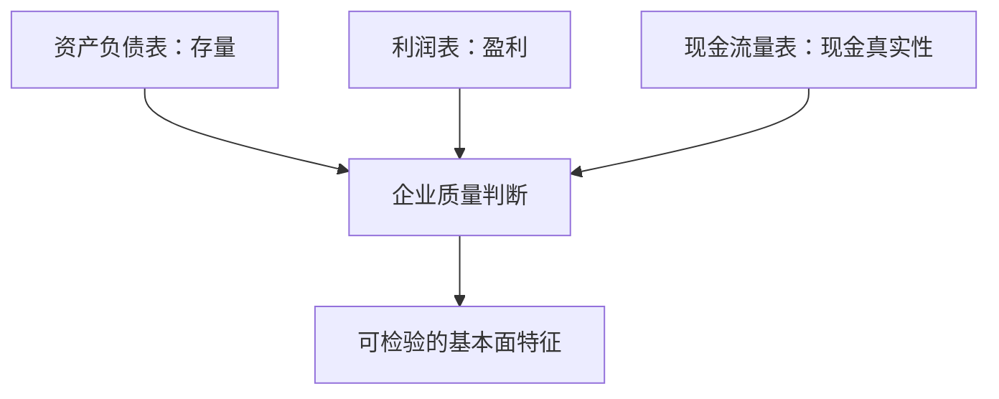

# 09｜基本面、宏观风格与技术指标分析

> [!WARNING] 风险提示
> 财务比率、宏观判断和技术指标都不是收益保证。它们只能形成可检验假设，必须经过样本外验证、成本检验和风险约束。

## 学习目标

1. 读懂三张财务报表各自回答的问题。
2. 手算 ROE、增长率与市盈率，并理解局限。
3. 区分宏观变量、行业暴露和市场风格。
4. 用 Pandas 计算均线、动量、波动率和 RSI。
5. 把分析变量按真实可得日期对齐。

## 目录

- [1. 三种分析视角](#1-三种分析视角)
- [2. 三张财务报表](#2-三张财务报表)
- [3. 盈利、成长与估值](#3-盈利成长与估值)
- [4. 财务数据的时点正确性](#4-财务数据的时点正确性)
- [5. 宏观、行业与风格](#5-宏观行业与风格)
- [6. 技术指标的计算](#6-技术指标的计算)
- [7. 组合分析示例](#7-组合分析示例)
- [8. 指标边界与排错](#8-指标边界与排错)
- [9. 工程验收](#9-工程验收)

## 1. 三种分析视角

| 视角 | 主要问题 | 常见数据 |
|---|---|---|
| 基本面 | 企业赚不赚钱、贵不贵、财务是否稳健 | 财报、公告、估值 |
| 宏观与风格 | 经济环境和资金偏好如何影响资产 | 利率、通胀、行业、规模 |
| 技术分析 | 价格与成交呈现什么历史状态 | OHLCV、收益率、波动率 |

三者并非互斥。一个多因子策略可以同时选择 ROE 较高、估值适中、中期动量为正的公司，同时限制行业偏离。

> [!IMPORTANT] 量化重点
> 指标只是从原始数据到特征的变换。先写清经济含义和可得时间，再讨论它是否具有预测能力。

## 2. 三张财务报表

### 2.1 资产负债表：某一时点拥有什么、欠什么

核心恒等式：

$$
资产 = 负债 + 所有者权益
$$

它像企业在某一天的照片。现金、存货和设备是资产；借款和应付款是负债。

### 2.2 利润表：一段时间赚了多少

简化关系：

$$
利润 = 收入 - 成本 - 费用 - 税费
$$

利润表是期间流量，年收入不能直接与某一天的现金余额比较。

### 2.3 现金流量表：现金从哪里来、到哪里去

通常分为经营、投资与筹资活动现金流。企业可能有会计利润，却因应收账款增长而没有收到足够现金，因此净利润与经营现金流需要结合分析。



## 3. 盈利、成长与估值

### 3.1 ROE

$$
ROE=\frac{归母净利润}{平均归母净资产}
$$

若期初净资产 8 亿元、期末 10 亿元、净利润 1.35 亿元：

$$
平均净资产=\frac{8+10}{2}=9\text{亿元}
$$

$$
ROE=\frac{1.35}{9}=15\%
$$

高 ROE 可能来自强盈利，也可能来自高杠杆或一次性收益。

### 3.2 收入增长率

$$
RevenueGrowth_t=\frac{Revenue_t}{Revenue_{t-1}}-1
$$

收入从 10 亿元增至 12 亿元，增长率为 20%，但还要检查利润和现金流是否同步。

### 3.3 市盈率与市净率

$$
PE=\frac{总市值}{归母净利润}
$$

若市值 100 亿元、净利润 5 亿元，PE 为 20 倍。净利润为负时，PE 通常失去直观意义。

$$
PB=\frac{总市值}{归母净资产}
$$

不同行业资产结构差异很大，跨行业直接比较可能误导。

### 3.4 简化质量评分

```python
import pandas as pd

fundamentals = pd.DataFrame({
    "symbol": ["AAA.SH", "BBB.SZ", "CCC.SH"],
    "roe": [0.15, 0.08, 0.12],
    "revenue_growth": [0.10, 0.25, -0.03],
    "cash_to_profit": [1.05, 0.55, 1.20],
})

for column in ["roe", "revenue_growth", "cash_to_profit"]:
    fundamentals[f"{column}_rank"] = fundamentals[column].rank(pct=True)

fundamentals["quality_score"] = fundamentals[
    ["roe_rank", "revenue_growth_rank", "cash_to_profit_rank"]
].mean(axis=1)
print(fundamentals.sort_values("quality_score", ascending=False))
```

这只是教学评分，尚未证明能预测未来。

## 4. 财务数据的时点正确性

假设 2025 年报期末为 2025-12-31，公告日为 2026-03-25，数据源在 2026-03-26 可用：

```text
2025-12-31 报告期末
      ↓ 此时不能使用
2026-03-25 正式公告
      ↓ 数据处理
2026-03-26 策略可得
```

回测 2026-01-15 时不能使用该年报。

```python
def latest_visible_record(df: pd.DataFrame, decision_date: str) -> pd.DataFrame:
    data = df.copy()
    data["available_date"] = pd.to_datetime(data["available_date"])
    visible = data[data["available_date"] <= pd.Timestamp(decision_date)]
    return (
        visible.sort_values(["symbol", "period_end", "available_date"])
        .groupby("symbol", as_index=False)
        .tail(1)
    )
```

> [!CAUTION] 回测陷阱
> 用报告期末而不是公告可得日对齐，会让策略提前数月知道结果。基本面回测异常优秀时，首先检查这一点。

还要留意财报更正、预告与快报、TTM 所需季度是否已公布，以及退市公司的历史记录是否保留。

## 5. 宏观、行业与风格

### 5.1 宏观变量

常见变量有利率、通胀、信用、汇率和经济增长。它们影响折现率、融资成本和企业需求，但关系会随市场阶段变化。

### 5.2 行业暴露

若策略 50% 持有银行而基准银行权重为 10%，主动行业权重为：

$$
ActiveWeight_{bank}=50\%-10\%=40\%
$$

跑赢可能来自行业押注，而非行业内选股。

### 5.3 常见风格

| 风格 | 常见代理变量 |
|---|---|
| 规模 | 总市值对数 |
| 价值 | 低 PB、低 PE、高股息率 |
| 成长 | 收入或利润增长 |
| 质量 | ROE、现金流、低杠杆 |
| 动量 | 过去若干月收益 |
| 低波动 | 历史波动率较低 |

风格标签不是永恒真理，去极值、中性化和样本范围都会改变结果。

## 6. 技术指标的计算

### 6.1 移动平均

$$
MA_t(n)=\frac{1}{n}\sum_{k=0}^{n-1}P_{t-k}
$$

```python
bars["ma_5"] = bars.groupby("symbol")["close"].transform(
    lambda s: s.rolling(5, min_periods=5).mean()
)
```

### 6.2 动量

$$
Momentum_t(n)=\frac{P_t}{P_{t-n}}-1
$$

```python
bars["momentum_20"] = bars.groupby("symbol")["close"].pct_change(20)
```

### 6.3 年化历史波动率

$$
\sigma_{annual}=\sigma_{daily}\sqrt{252}
$$

```python
bars["return"] = bars.groupby("symbol")["close"].pct_change()
bars["volatility_20"] = bars.groupby("symbol")["return"].transform(
    lambda s: s.rolling(20).std(ddof=1) * (252 ** 0.5)
)
```

252 是常用近似值，不是永恒常数；也可依据实际频率和交易日数设定。

### 6.4 RSI

$$
RS=\frac{AverageGain}{AverageLoss}
$$

$$
RSI=100-\frac{100}{1+RS}
$$

```python
delta = bars.groupby("symbol")["close"].diff()
gain = delta.clip(lower=0)
loss = -delta.clip(upper=0)
avg_gain = gain.groupby(bars["symbol"]).transform(
    lambda s: s.rolling(14).mean()
)
avg_loss = loss.groupby(bars["symbol"]).transform(
    lambda s: s.rolling(14).mean()
)
rs = avg_gain / avg_loss.replace(0, pd.NA)
bars["rsi_14"] = 100 - 100 / (1 + rs)
```

> [!IMPORTANT] 量化重点
> 指标只用当前与过去数据；当它变成交易信号时，还要匹配实际下单时点，通常不能用本日收盘信号在同一本日收盘成交。

## 7. 组合分析示例

目标：在历史可见股票池内寻找质量较高、中期动量为正、波动不过高的候选证券。

```python
features = market_features.merge(
    visible_fundamentals,
    on=["date", "symbol"],
    how="inner",
    validate="many_to_one",
)

eligible = features[
    (features["roe"] > 0)
    & (features["momentum_20"] > 0)
    & features["volatility_20"].notna()
].copy()

eligible["roe_rank"] = eligible.groupby("date")["roe"].rank(pct=True)
eligible["momentum_rank"] = eligible.groupby("date")[
    "momentum_20"
].rank(pct=True)
eligible["low_vol_rank"] = 1 - eligible.groupby("date")[
    "volatility_20"
].rank(pct=True)

eligible["score"] = (
    0.4 * eligible["roe_rank"]
    + 0.4 * eligible["momentum_rank"]
    + 0.2 * eligible["low_vol_rank"]
)
```

这还不是完整策略，因为尚未定义选几只、何时调仓、如何分配权重、成交时点、成本、A 股约束、基准和拒绝条件。

## 8. 指标边界与排错

### 参数不断调到历史最好

这通常是过拟合。应预先规定候选范围，保留样本外区间并检查参数敏感性。

### 跨行业直接比较 PE

行业资本结构不同。可在行业内排序，或明确做行业中性化。

### 把技术指标当预测保证

均线只总结过去价格，不知道未来。必须验证成本后、约束后和样本外表现。

### 宏观数据使用修订终值

真实决策当时可能只看到初值。应使用历史版本或保守的可得延迟。

### ROE 高就认定公司优秀

继续检查负债、一次性损益、现金流、减值和行业周期。

## 9. 工程验收

> [!TIP] 工程验收
> - 每个因子都有公式、方向、输入、窗口、可得时间和缺失处理说明。
> - 财务数据严格按可得日连接。
> - 技术指标按证券分组、按日期排序。
> - 指标计算与手算小样本一致。
> - 输出保存原始值、处理值和版本。

## 本章总结

基本面描述企业，宏观与风格描述共同风险来源，技术指标描述价格成交状态。严谨量化不迷信任何一类指标，而是把它们变成时间正确、定义明确、可以被拒绝的研究假设。

## 自测题

1. 高 ROE 为什么不必然意味着高质量？
2. 年报应按报告期末还是可得日期进入策略？
3. 20 日均线何时首次完整可用？
4. 组合跑赢基准为什么不等于选股有效？

<details>
<summary>展开参考答案</summary>

1. 可能来自高杠杆、一次性利润或很小的净资产基数。
2. 按真实公告和处理后的可得日期。
3. 无缺失且 `min_periods=20` 时，在第 20 条观测后。
4. 超额收益可能来自行业、规模、风格或择时暴露。

</details>

## 下一章

下一章把“感觉指标有用”改写成可验证的策略协议：[第 10 章 研究假设、信号与订单](./10-研究假设信号仓位与订单.md)。

## 贯穿案例检查点：为每个指标写数据字典

不要只创建 `momentum_20` 列。为它保存：

```yaml
name: momentum_20
meaning: 过去 20 个交易日复权收盘收益
formula: adjusted_close[t] / adjusted_close[t-20] - 1
direction: higher_is_stronger
frequency: daily
decision_time: after_close
minimum_history: 21
missing_policy: exclude
version: 1
```

同样为 ROE 写清分子、分母、平均净资产口径和 `available_date`。未来修改公式时增加版本，不覆盖旧定义。

### 指标手算验收

取 21 个连续价格，手算第 21 日动量；再用 Pandas `pct_change(20)` 对照。若不一致，先检查排序、复权、窗口和缺失，而不是立即改公式。

> [!TIP] 工程验收
> 因子表中任意一列都能追溯到数据字典和输入字段，未知口径的列不得进入策略。
