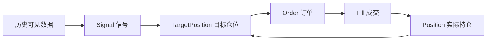

# 10｜从研究假设到信号、仓位与订单

> [!WARNING] 风险提示
> 历史规律可能由偶然、偏差或过拟合造成。本章只定义研究与模拟交易流程，不提供荐股或收益承诺。

## 学习目标

1. 把模糊想法改写成可证伪的研究假设。
2. 严格区分 Signal、TargetPosition、Order、Fill 和 Position。
3. 定义决策时点、成交时点、基准、成本与拒绝条件。
4. 从目标权重计算订单数量，并处理现金与整手约束。
5. 为后续向量化和事件驱动回测准备统一对象。

## 目录

- [1. 一个想法还不是策略](#1-一个想法还不是策略)
- [2. 研究协议的九个问题](#2-研究协议的九个问题)
- [3. 五个对象不能混用](#3-五个对象不能混用)
- [4. 从信号到目标仓位](#4-从信号到目标仓位)
- [5. 从目标仓位到订单](#5-从目标仓位到订单)
- [6. 均线案例的完整定义](#6-均线案例的完整定义)
- [7. 失败路径与排错](#7-失败路径与排错)
- [8. 工程验收](#8-工程验收)

## 1. 一个想法还不是策略

“上涨的股票可能继续上涨”只是直觉。要成为研究假设，至少要明确：

- “上涨”用过去多少日收益衡量？
- 在哪些股票中比较？
- 信号何时计算？
- 何时买入、持有多久？
- 收益和风险与什么基准比较？
- 包含哪些成本和交易限制？
- 什么结果会让我们放弃假设？

一个可证伪表述示例：

> 在 2018-01-01 至 2025-12-31 的历史可交易 A 股股票池中，每月末按过去 120 个交易日收益排序，剔除最近 5 个交易日，等权持有前 10%，下一交易日开盘调仓；在计入费用、滑点、停牌、涨跌停和整手约束后，样本外年化超额收益应为正，且不同年份方向不应完全相反。

这并不保证假设成立，但它能被复现、质疑与拒绝。

> [!IMPORTANT] 量化重点
> 研究的价值不是“证明自己对”，而是让错误假设尽早、低成本地暴露。

## 2. 研究协议的九个问题

建议每个策略先填写：

| 项目 | 必须回答 |
|---|---|
| 研究对象 | 哪些证券、哪个市场、何种频率 |
| 样本区间 | 训练、验证、测试分别是什么时间 |
| 数据可见性 | 每个输入何时可得 |
| 信号公式 | 输入、窗口、方向、缺失处理 |
| 执行规则 | 信号后何时下单、用什么价格 |
| 仓位规则 | 目标权重、上限、现金缓冲 |
| 成本与约束 | 费用、滑点、T+1、停牌、涨跌停 |
| 基准 | 宽基指数、等权股票池或现金 |
| 拒绝条件 | 哪些样本外或压力结果代表失败 |

### 教学均线协议

| 项目 | 定义 |
|---|---|
| 股票池 | 教学数据中的可交易证券 |
| 信号 | 5 日均线高于 20 日均线 |
| 决策时点 | $t$ 日收盘后 |
| 目标仓位 | 条件成立为 100%，否则 0% |
| 成交时点 | $t+1$ 交易日开盘 |
| 基准 | 买入并持有 |
| 第一轮成本 | 0，验证对齐 |
| 第二轮成本 | 佣金、税费、滑点 |
| 第三轮约束 | T+1、停牌、涨跌停、整手 |
| 拒绝条件 | 样本外不稳健或成本后失去意义 |

## 3. 五个对象不能混用



### 3.1 Signal：研究观点

例如 `score=0.8` 或 `long=True`。它不表示账户已经买入。

### 3.2 TargetPosition：希望账户达到什么状态

例如目标权重 20%，或目标持股 1000 股。

### 3.3 Order：提交给撮合器的请求

包含买卖方向、数量、订单类型、限价和提交时间。

### 3.4 Fill：实际成交事实

包含成交数量、成交价格、费用和成交时间。订单可能完全成交、部分成交、拒绝或一直未成交。

### 3.5 Position：账户实际持有

由历史成交与公司行为共同决定。实际持仓可能因整手、资金不足、停牌或部分成交偏离目标仓位。

> [!CAUTION] 回测陷阱
> 把信号直接当仓位，等价于假设订单永远能立即、足量、无成本成交。

## 4. 从信号到目标仓位

### 4.1 二值信号

```python
data["signal"] = (data["ma_fast"] > data["ma_slow"]).astype(int)
data["target_weight"] = data["signal"] * 1.0
```

### 4.2 连续信号

连续评分需要映射到风险可控的权重：

$$
w_i^{raw}=\frac{\max(score_i,0)}{\sum_j\max(score_j,0)}
$$

然后应用单票上限：

```python
positive = scores.clip(lower=0)
raw_weight = positive / positive.sum()
capped_weight = raw_weight.clip(upper=0.10)
target_weight = capped_weight / capped_weight.sum()
```

实际优化还需处理上限截断后的再分配、行业约束和现金。

### 4.3 波动率目标

若策略预测年化波动率为 $\hat{\sigma}$、目标波动率为 $\sigma^*$，简化仓位缩放：

$$
leverage=\min\left(L_{max},\frac{\sigma^*}{\hat{\sigma}}\right)
$$

预测波动率极低时必须设置下限，避免仓位异常放大。

## 5. 从目标仓位到订单

账户权益 $E=100000$ 元，某股票目标权重 20%，价格 12.30 元，当前持有 300 股。

目标市值：

$$
V^*=100000\times20\%=20000
$$

理论目标股数：

$$
q^*=\frac{20000}{12.30}\approx1626.02
$$

若买入按 100 股整手向下取整：

$$
q_{lot}=\left\lfloor\frac{1626.02}{100}\right\rfloor\times100=1600
$$

订单数量：

$$
\Delta q=1600-300=1300
$$

```python
import math

def target_order_quantity(
    equity: float,
    target_weight: float,
    price: float,
    current_quantity: int,
    lot_size: int = 100,
) -> int:
    if price <= 0:
        raise ValueError("价格必须大于 0")
    theoretical = equity * target_weight / price
    target_quantity = math.floor(theoretical / lot_size) * lot_size
    return target_quantity - current_quantity

quantity = target_order_quantity(
    equity=100_000,
    target_weight=0.20,
    price=12.30,
    current_quantity=300,
)
print(quantity)
```

预期输出：

```text
1300
```

> [!IMPORTANT] A 股规则
> 申报单位、零股处理、不同板块规则和例外情况会变化。项目应按证券、市场、板块和核验日期配置，不能假设所有买卖永远都是 100 股整数倍。

### 现金校验

买入需要的不是只有成交额：

$$
CashRequired=qP+Commission+OtherFees
$$

若现金不足，订单生成器应缩量或拒绝，不能让现金无约束变成负数。

## 6. 均线案例的完整定义

### 6.1 计算信号

```python
import pandas as pd

def moving_average_signal(
    bars: pd.DataFrame,
    fast: int = 5,
    slow: int = 20,
) -> pd.DataFrame:
    if fast <= 0 or slow <= 0 or fast >= slow:
        raise ValueError("窗口必须满足 0 < fast < slow")

    data = bars.sort_values(["symbol", "date"]).copy()
    grouped = data.groupby("symbol")["close"]
    data["ma_fast"] = grouped.transform(
        lambda s: s.rolling(fast, min_periods=fast).mean()
    )
    data["ma_slow"] = grouped.transform(
        lambda s: s.rolling(slow, min_periods=slow).mean()
    )
    data["signal"] = (data["ma_fast"] > data["ma_slow"]).astype(int)
    data.loc[data["ma_slow"].isna(), "signal"] = 0
    return data
```

### 6.2 明确时间

若 `close[t]` 只有收盘后才完整可知，则 `signal[t]` 不能假设在同一收盘价成交。常见简化是：

$$
position_t=signal_{t-1}
$$

更真实的事件驱动模型则把 $t$ 日收盘后的订单放到 $t+1$ 日撮合。

### 6.3 领域对象

```python
from dataclasses import dataclass
from datetime import datetime
from enum import Enum

class Side(str, Enum):
    BUY = "BUY"
    SELL = "SELL"

@dataclass(frozen=True)
class Signal:
    symbol: str
    generated_at: datetime
    score: float

@dataclass(frozen=True)
class TargetPosition:
    symbol: str
    target_weight: float
    decided_at: datetime

@dataclass(frozen=True)
class Order:
    symbol: str
    side: Side
    quantity: int
    submitted_at: datetime
```

类型分开后，日志能回答“策略想买、订单已发、为什么没成交、最终持有多少”。

## 7. 失败路径与排错

### 信号日期和收益日期相同

如果收盘信号直接乘本日收盘收益，通常存在未来函数。先画出决策和成交时间线。

### 目标权重之和超过 100%

检查是否允许杠杆；不允许时归一化并预留费用现金。

### 每天产生大量微小订单

设置最小调仓差异、最小订单金额或固定调仓频率，避免成本吞噬。

### 目标仓位正确但持仓不一致

查看订单状态：资金不足、整手取整、停牌、涨跌停、T+1 或部分成交都可能造成差异。

### 卖出数量超过可卖数量

区分总持仓和可用持仓，A 股日内新买入股票通常不能同日卖出。

## 8. 工程验收

> [!TIP] 工程验收
> - 每个策略都有版本化研究协议。
> - Signal、TargetPosition、Order、Fill、Position 是独立类型。
> - 信号时间严格早于或等于订单生成时间，成交不早于订单。
> - 权重、现金、整手和可卖数量都有校验。
> - 被拒订单保存明确原因。

## 本章总结

策略不是一列买卖信号，而是一条可审计状态链。研究假设先定义“为什么可能有效”，目标仓位表达投资意图，订单表达交易请求，成交和持仓记录现实结果。

## 自测题

1. `signal=1` 为什么不等于账户已满仓？
2. 收盘后生成的信号为何通常不能按同日收盘成交？
3. 目标 1626 股为何示例只买到 1600 股？
4. 哪些情况会让实际持仓偏离目标仓位？

<details>
<summary>展开参考答案</summary>

1. 信号还要经过仓位、订单、资金、撮合和市场约束。
2. 信号依赖完整收盘价，知道该价格时同一收盘成交机会已过去。
3. 教学假设买入按 100 股整手向下取整。
4. 资金不足、费用、整手、停牌、涨跌停、T+1、部分成交等。

</details>

## 下一章

下一章先用最透明的方式验证收益对齐：[第 11 章 手写向量化回测](./11-手写向量化回测.md)。

## 贯穿案例检查点：保存状态变化表

对一个证券至少输出：

| 日期 | close | signal | target_weight | order_qty | order_status | fill_qty | position |
|---|---:|---:|---:|---:|---|---:|---:|
| $t$ | 10.00 | 1 | 0.20 | 0 | 无 | 0 | 0 |
| $t+1$ | 10.10 | 1 | 0.20 | 1900 | FILLED | 1900 | 1900 |
| $t+2$ | 10.20 | 0 | 0.00 | -1900 | NEW | 0 | 1900 |

表中数值只是格式示例。真正运行时，`order_qty` 必须由账户权益、价格、整手、当前持仓和现金共同计算。

### 三个不变量

```python
assert fill.quantity <= order.quantity
assert position.quantity >= 0
assert portfolio.cash >= -1e-8
```

如果项目不允许卖空和融资，这三个断言应始终成立。

> [!CAUTION] 回测陷阱
> 只保存最终仓位会掩盖订单未成交和延迟成交；状态表是定位“想持有”和“实际持有”差异的最短路径。
