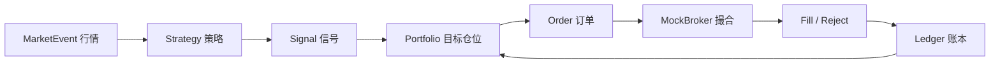
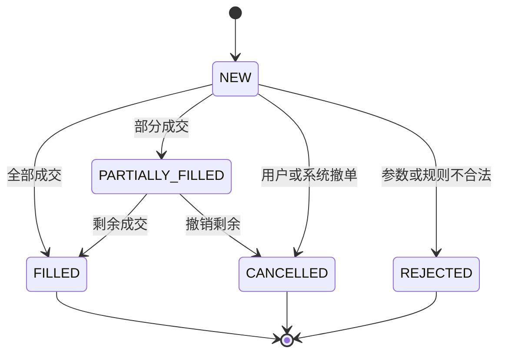

# 12｜事件驱动回测与 A 股真实交易约束

> [!WARNING] 风险提示
> 本章模拟器只用于研究和模拟盘，不连接真实券商、不发送真实订单。市场制度和费用须按使用日期重新核验。

## 学习目标

1. 理解事件驱动回测的时钟、事件、策略、组合、经纪商和账本。
2. 模拟订单从创建到成交、拒绝或撤销的生命周期。
3. 建模 T+1、停牌、涨跌停、整手、费用和现金不足。
4. 用项目中的 Python `MockBroker` 运行确定性案例。
5. 比较向量化与事件驱动结果为何不同。

## 目录

- [1. 为什么需要事件驱动](#1-为什么需要事件驱动)
- [2. 系统组成和事件顺序](#2-系统组成和事件顺序)
- [3. 订单状态机](#3-订单状态机)
- [4. A 股约束逐项建模](#4-a-股约束逐项建模)
- [5. 账户账本](#5-账户账本)
- [6. 使用项目 MockBroker](#6-使用项目-mockbroker)
- [7. 运行配套回测](#7-运行配套回测)
- [8. 确定性测试](#8-确定性测试)
- [9. 常见失败与排错](#9-常见失败与排错)

## 1. 为什么需要事件驱动

向量化回测擅长回答“如果每天拥有这组权重，历史收益如何”。但它不自然表达：

- 订单提交后未成交。
- 一张订单只成交一部分。
- 买入当天不可卖。
- 停牌期间订单仍处于等待状态。
- 资金不足导致拒绝。
- 同一天先成交还是先结算。

事件驱动系统按照时间顺序处理事实，状态每一步都可审计。



> [!IMPORTANT] 量化重点
> 事件顺序就是模型假设。若顺序不明确，同一份数据可能得到不同成交与收益。

## 2. 系统组成和事件顺序

### 2.1 六个核心组件

| 组件 | 职责 |
|---|---|
| Clock | 推进交易日与日内时点 |
| DataProvider | 提供当时可见数据 |
| Strategy | 从数据生成信号 |
| Portfolio | 将信号变为目标和订单 |
| Broker | 校验、撮合、收费 |
| Ledger | 记录现金、持仓、成交和净值 |

### 2.2 教学日线顺序

本教程统一采用：

```text
t-1 日收盘：计算信号，生成下一日目标
        ↓
t 日开盘：检查停牌、涨跌停、限价、资金和可卖数量
        ↓
生成 Fill 或 Reject
        ↓
t 日收盘：按收盘价估值并保存快照
        ↓
日终结算：今日买入数量在下一交易日变为可卖
```

应在系统设计文档中写死顺序并测试，而不是由循环偶然决定。

## 3. 订单状态机



配套项目目前实现最小状态 `NEW`、`FILLED`、`REJECTED` 和 `CANCELLED`。部分成交作为后续扩展，不应伪装成已完整支持。

每次状态转换至少记录：

- 订单编号。
- 原状态和新状态。
- 发生时间。
- 原因。
- 剩余数量。
- 对应成交编号。

## 4. A 股约束逐项建模

### 4.1 T+1 可卖约束

账户要区分：

- `quantity`：总持股数量。
- `sellable_quantity`：当前可卖数量。

当日买入 100 股后：

| 时点 | quantity | sellable_quantity |
|---|---:|---:|
| 买入前 | 0 | 0 |
| 当日成交后 | 100 | 0 |
| 下一交易日结算后 | 100 | 100 |

卖出校验：

$$
q_{sell}\le q_{sellable}
$$

> [!IMPORTANT] A 股规则
> 本教程以常见股票现货日内买入不可同日卖出为教学模型。不同证券类型可能不同，正式使用必须按证券品种和现行规则核验。

### 4.2 停牌

若 `bar.is_suspended=True`：

- 不能产生新成交。
- 原订单是保留还是取消，由订单有效期决定。
- 持仓仍要按明确估值规则进入账户快照。

### 4.3 涨跌停

“价格等于涨停价”不自动等于绝对不能买到，但只用日线 OHLC 时无法还原排队和盘口。教程采用保守规则：

- 开盘触及涨停价：买入不保证成交，拒绝。
- 开盘触及跌停价：卖出不保证成交，拒绝。

这是模型假设，报告中必须披露。

### 4.4 整手与零股

买入订单数量通常按配置的 `lot_size` 校验：

$$
q>0,\quad q\bmod lot\_size=0
$$

当前教学经纪商对买卖都采用相同整手校验，便于入门测试；更完整实现应依据现行市场规则处理卖出零股和不同板块例外。

### 4.5 交易费用

买入支出：

$$
CashOut=qP+Commission+OtherFees
$$

卖出收入：

$$
CashIn=qP-Commission-Tax-OtherFees
$$

项目将费率放在配置中，不将其宣称为永久事实。

### 4.6 滑点

教学回测的简化成交价：

$$
P_{buy}=P_{open}(1+s)
$$

$$
P_{sell}=P_{open}(1-s)
$$

$s$ 为滑点率。真实冲击与订单大小、盘口深度、波动率和成交量相关。

## 5. 账户账本

每次成交必须满足复式思维：现金变化和持仓变化同时记录。

### 买入 100 股，价格 10 元，佣金 5 元

$$
\Delta Cash=-(100\times10+5)=-1005
$$

$$
\Delta Position=+100
$$

### 卖出 100 股，价格 11 元，佣金 5 元，税费 0.55 元

$$
\Delta Cash=100\times11-5-0.55=1094.45
$$

$$
\Delta Position=-100
$$

账户权益：

$$
Equity_t=Cash_t+\sum_i q_{i,t}P_{i,t}
$$

> [!TIP] 工程验收
> 任意成交后，都能由成交记录重新计算现金和持仓；账本不能只保存最后结果。

## 6. 使用项目 MockBroker

项目位于 `quant-lab`，后端全部使用 Python。核心文件：

- `src\quant_lab\core\models.py`：领域对象。
- `src\quant_lab\paper\broker.py`：`BrokerAdapter` 与 `MockBroker`。
- `src\quant_lab\backtest\engine.py`：教学日线回测。

### 6.1 创建经纪商和行情

```python
from datetime import date

from quant_lab.core.models import Bar, Side
from quant_lab.paper.broker import MockBroker

broker = MockBroker(
    cash=100_000.0,
    lot_size=100,
    commission_rate=0.0003,
    minimum_commission=5.0,
    sell_tax_rate=0.0005,
)

bar = Bar(
    trading_date=date(2026, 1, 5),
    symbol="600000.SH",
    open=10.0,
    high=10.2,
    low=9.9,
    close=10.1,
    volume=1_000_000,
    is_suspended=False,
    limit_up=11.0,
    limit_down=9.0,
)

order = broker.submit(
    symbol="600000.SH",
    side=Side.BUY,
    quantity=100,
    trading_date=bar.trading_date,
)
fill = broker.match(order, bar)

print(order.status)
print(fill)
print(broker.cash)
print(broker.positions["600000.SH"])
```

买入后总持仓为 100，但可卖数量仍为 0。

### 6.2 验证 T+1

```python
sell_today = broker.submit(
    symbol="600000.SH",
    side=Side.SELL,
    quantity=100,
    trading_date=bar.trading_date,
)
broker.match(sell_today, bar)
print(sell_today.status, sell_today.reject_reason)

broker.settle()
print(broker.positions["600000.SH"].sellable_quantity)
```

结算后可卖数量才变成 100。

### 6.3 验证停牌

```python
suspended_bar = Bar(
    trading_date=date(2026, 1, 6),
    symbol="600000.SH",
    open=10.1,
    high=10.1,
    low=10.1,
    close=10.1,
    volume=0,
    is_suspended=True,
)
order = broker.submit(
    "600000.SH", Side.SELL, 100, suspended_bar.trading_date
)
assert broker.match(order, suspended_bar) is None
assert len(broker.fills) == 1
```

项目当前对停牌订单保持 `NEW`，这是一个需要由订单有效期规则进一步决定的设计点。

## 7. 运行配套回测

在 PowerShell 中：

```powershell
Set-Location <仓库目录>\quant-lab
python -m venv .venv
.\.venv\Scripts\python.exe -m pip install -e ".[dev]"
.\.venv\Scripts\pytest.exe -q
```

调用教学回测：

```python
from datetime import date

from quant_lab.backtest.engine import run_moving_average_backtest
from quant_lab.core.models import BacktestConfig
from quant_lab.data.provider import CsvDataProvider

provider = CsvDataProvider(r"data")
config = BacktestConfig(
    symbols=("600000.SH",),
    start_date=date(2024, 1, 1),
    end_date=date(2026, 12, 31),
    initial_cash=100_000.0,
    short_window=3,
    long_window=5,
)

result = run_moving_average_backtest(provider, config)
print(result.metrics)
print("成交数:", len(result.fills))
print("快照数:", len(result.snapshots))
```

如果数据文件中的证券代码或日期区间不同，应先查询 `provider.instruments()` 和行情范围，而不是猜测。

## 8. 确定性测试

### 8.1 非整手拒绝

```python
def test_rejects_odd_lot():
    broker = MockBroker(cash=100_000, lot_size=100)
    order = broker.submit(
        "600000.SH", Side.BUY, 150, date(2026, 1, 5)
    )
    assert order.status.value == "rejected"
    assert "100" in order.reject_reason
```

### 8.2 现金守恒

不考虑市值变化时：

```python
expected_cash = 100_000 - fill.price * fill.quantity - fill.commission
assert abs(broker.cash - expected_cash) < 1e-8
```

### 8.3 约束对照

对同一数据分别运行：

1. 无成本、理想成交。
2. 加费用和滑点。
3. 加停牌、涨跌停、T+1 与整手。

逐笔比较订单、成交和账户快照，定位差异来自哪条现实规则。

## 9. 常见失败与排错

### 同一订单被成交两次

撮合前必须检查订单状态只有 `NEW` 或 `PARTIALLY_FILLED`。

### 买入后现金正确，卖出后错误

检查卖出税费方向、佣金最低收费和现金加减号。

### T+1 永远无法卖出

检查 `settle()` 是否在交易日结束调用；不要在买入成交后立即结算。

### 涨停判断报错

`limit_up` 可能为空。先明确无涨跌幅限制证券的行为，避免直接比较 `float` 和 `None`。

### 停牌持仓市值变成零

撮合禁止成交与收盘估值是两件事。估值需要沿用最近可得价格或规定的估值数据。

### 事件驱动结果与向量化不同

先比较信号与目标，再比较成交日期、成交价、取整、资金、费用和拒绝原因。不同并不一定是错误，可能是现实约束发挥作用。

> [!CAUTION] 回测陷阱
> 日线数据无法知道涨跌停排队、日内路径与真实盘口。保守成交假设仍是模型，不应包装成真实成交事实。

## 本章总结

事件驱动回测把策略从收益公式推进到订单和账本。它的价值在于明确状态与顺序：策略想做什么、订单为何失败、账户最终发生了什么，都可以被追溯。

## 自测题

1. 为什么总持仓和可卖持仓必须分开？
2. 停牌时为何不能简单把持仓市值设为零？
3. 开盘涨停就拒绝买入是事实还是模型假设？
4. 账本为何必须保存每次成交而不只保存最终现金？

<details>
<summary>展开参考答案</summary>

1. 当日新买入股票通常要到下一交易日才可卖，二者可能不同。
2. 停牌代表不可交易，不代表资产价值归零；应使用明确估值规则。
3. 是日线条件下的保守模型假设，真实成交还与排队和盘口有关。
4. 只有逐笔记录才能复算、审计并定位资金或持仓错误。

</details>

## 下一章

得到回测结果后，需要判断收益从哪里来、是否稳定：[第 13 章 绩效、归因与过拟合防控](./13-绩效评估收益归因与过拟合防控.md)。

## 贯穿案例检查点：事件日志必须能重放

建议记录：

```text
2025-01-09 15:00 SIGNAL 600000.SH score=1
2025-01-09 15:01 TARGET 600000.SH weight=0.20
2025-01-10 09:25 ORDER buy quantity=1900
2025-01-10 09:30 REJECT reason=limit_up
2025-01-10 15:00 SNAPSHOT cash=100000 position=0
```

从日志可以回答：策略判断正确执行了吗？订单为何没有成交？账户为何仍是现金？

### 账本复算

把初始现金、所有 Fill 和每日估值价交给一个独立函数，重新计算快照，与回测输出逐日比较：

```python
for expected, replayed in zip(result.snapshots, replay_snapshots):
    assert expected.trading_date == replayed.trading_date
    assert abs(expected.total_equity - replayed.total_equity) < 1e-8
```

> [!TIP] 工程验收
> 若无法仅凭配置、数据快照和事件日志重建结果，该回测还不具备可审计性。
