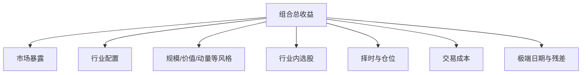
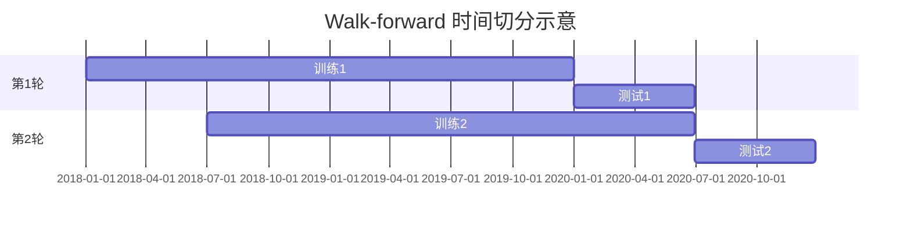

# 13｜绩效评估、收益归因与过拟合防控

> [!WARNING] 风险提示
> 单个收益数字不能证明策略有效。指标会受样本区间、频率、基准、成本和极端行情影响，必须结合归因与样本外检验。

## 学习目标

1. 计算年化收益、波动率、Sharpe、Sortino、Calmar、胜率和换手率。
2. 用正确基准衡量超额收益。
3. 把收益拆解为市场、行业、风格、选股、择时与成本贡献。
4. 设计训练、验证、测试和 Walk-forward 流程。
5. 识别参数挖掘、多重检验和“只展示最佳结果”。

## 目录

- [1. 先看完整结果而非收益冠军](#1-先看完整结果而非收益冠军)
- [2. 收益与风险指标](#2-收益与风险指标)
- [3. 基准和超额收益](#3-基准和超额收益)
- [4. 收益归因](#4-收益归因)
- [5. 过拟合是如何发生的](#5-过拟合是如何发生的)
- [6. 时间序列验证](#6-时间序列验证)
- [7. 稳健性检查清单](#7-稳健性检查清单)
- [8. 可运行评估代码](#8-可运行评估代码)
- [9. 排错与工程验收](#9-排错与工程验收)

## 1. 先看完整结果而非收益冠军

两个策略可能有相同总收益，但风险完全不同：

| 指标 | 策略 A | 策略 B |
|---|---:|---:|
| 年化收益 | 12% | 12% |
| 年化波动率 | 10% | 28% |
| 最大回撤 | -8% | -35% |
| 年换手 | 1 倍 | 30 倍 |
| 单一行业最高权重 | 20% | 75% |

只看年化收益会把两者当成一样。

> [!IMPORTANT] 量化重点
> 绩效报告至少同时展示收益、风险、交易、暴露、基准、成本和稳定性。

## 2. 收益与风险指标

### 2.1 总收益与年化收益

初始净值 $NAV_0$、期末净值 $NAV_T$：

$$
R_{total}=\frac{NAV_T}{NAV_0}-1
$$

若样本跨越 $Y$ 年：

$$
R_{annual}=\left(\frac{NAV_T}{NAV_0}\right)^{1/Y}-1
$$

不要简单把短期收益乘以 252，复利和样本长度会造成差异。

### 2.2 年化波动率

日收益标准差为 $\sigma_d$：

$$
\sigma_{annual}=\sigma_d\sqrt{252}
$$

252 是常用近似值，报告应注明频率和年化因子。

### 2.3 Sharpe 比率

$$
Sharpe=\frac{R_p-R_f}{\sigma_p}
$$

$R_f$ 是无风险收益。教学中若设为 0 必须明确说明。

### 2.4 Sortino 比率

Sortino 只把下行偏离放入分母：

$$
Sortino=\frac{R_p-R_f}{DownsideDeviation}
$$

它没有消除分布非正态、样本选择等问题。

### 2.5 Calmar 比率

$$
Calmar=\frac{R_{annual}}{|MDD|}
$$

若最大回撤接近 0，数值可能异常大，需要防止除零。

### 2.6 胜率与盈亏比

$$
WinRate=\frac{盈利交易数}{全部已平仓交易数}
$$

高胜率不等于赚钱。赚 9 次各 1 元、亏 1 次 20 元，胜率 90% 仍亏损。

### 2.7 换手率

组合换手口径并不唯一。若定义为每日权重绝对变化之和：

$$
Turnover_t=\sum_i|w_{i,t}-w_{i,t-1}|
$$

报告必须写出是否除以 2、是否包含现金与申赎。

## 3. 基准和超额收益

### 3.1 为什么需要基准

牛市中策略赚 20%，宽基指数涨 35%，不能只说策略表现优秀。基准回答“如果不用复杂策略，承担相近市场风险会怎样”。

常见基准：

- 与股票池匹配的宽基指数。
- 股票池等权组合。
- 买入持有。
- 现金或短期利率。

### 3.2 超额收益

简单近似：

$$
r_{active,t}=r_{portfolio,t}-r_{benchmark,t}
$$

更严谨的相对财富：

$$
NAV_{relative,t}=\frac{NAV_{portfolio,t}}{NAV_{benchmark,t}}
$$

### 3.3 Beta 与 Alpha

简化市场模型：

$$
r_{p,t}-r_{f,t}=\alpha+\beta(r_{m,t}-r_{f,t})+\epsilon_t
$$

正收益可能来自 $\beta>1$ 的高市场暴露，而不是稳定 Alpha。

> [!CAUTION] 回测陷阱
> 基准必须与投资范围、再投资、频率和币种一致。只挑一个最容易战胜的基准属于事后选择。

## 4. 收益归因

归因试图回答“收益究竟从哪里来”：



### 4.1 行业贡献

近似贡献：

$$
Contribution_{j,t}=w_{j,t-1}r_{j,t}
$$

主动行业贡献还需与基准行业权重和收益对照。

### 4.2 交易成本归因

保存毛收益和净收益：

$$
CostDrag=R_{gross}-R_{net}
$$

不要只保存净值，否则无法知道策略失效是信号差还是交易太频繁。

### 4.3 极端日期贡献

```python
daily = result.frame.copy()
worst = daily.nsmallest(10, "net_return")[
    ["net_return", "position", "turnover", "cost"]
]
print(worst)
```

若全年收益主要来自一两天，结果对执行和数据误差非常敏感。

## 5. 过拟合是如何发生的

### 5.1 参数搜索

测试 1000 组均线参数，总会有一些历史表现很好，即使真实规律不存在。

### 5.2 研究者自由度

不断改变：

- 样本起止日期。
- 股票池和剔除条件。
- 指标窗口。
- 成本口径。
- 绩效指标。

直到出现满意曲线，也是一种隐性多重检验。

### 5.3 只展示幸存策略

若研究过 100 个策略，只报告最好的 1 个，读者看不到其余 99 次失败，显著性被夸大。

### 5.4 复杂度无成本增长

每增加一个过滤条件都能更贴合历史噪声。复杂模型应有明确经济理由，并用样本外结果支付“复杂度成本”。

## 6. 时间序列验证

随机打乱切分会让未来样本进入训练。时间序列应保持先后关系。

### 6.1 三段式

```text
训练集：提出和拟合模型
验证集：选择有限参数
测试集：最后只评估一次
```

测试集若被反复查看，也会变成新的验证集。

### 6.2 Walk-forward



每一轮只用当时过去的数据拟合，再测试未来一段，并串联所有测试期结果。

```python
def expanding_splits(dates, min_train: int, test_size: int):
    n = len(dates)
    end_train = min_train
    while end_train + test_size <= n:
        train_index = slice(0, end_train)
        test_index = slice(end_train, end_train + test_size)
        yield train_index, test_index
        end_train += test_size
```

### 6.3 参数敏感性

稳健策略通常不会只在一个尖锐参数点有效。画出快慢均线组合的样本外指标，如果只有 `fast=7, slow=31` 极佳、邻近参数全失效，应高度警惕。

## 7. 稳健性检查清单

至少执行：

1. 更换相邻参数。
2. 改变起止日期。
3. 分年度和牛熊阶段展示。
4. 提高成本与滑点。
5. 延迟一个交易日成交。
6. 改变股票池与基准。
7. 对异常日和极端股票做贡献分析。
8. 检查不同数据快照。
9. 使用从未参与调参的最终测试集。

稳健不是“所有检验都赚钱”，而是结果方向有解释、对合理扰动不过分脆弱。

## 8. 可运行评估代码

```python
import numpy as np
import pandas as pd

def performance_report(
    net_returns: pd.Series,
    periods_per_year: int = 252,
    risk_free_rate: float = 0.0,
) -> dict[str, float]:
    returns = net_returns.dropna().astype(float)
    if returns.empty:
        raise ValueError("收益序列为空")
    if (returns <= -1).any():
        raise ValueError("单期收益不能小于或等于 -100%")

    equity = (1 + returns).cumprod()
    years = len(returns) / periods_per_year
    annual_return = equity.iloc[-1] ** (1 / years) - 1 if years > 0 else np.nan
    annual_vol = returns.std(ddof=1) * np.sqrt(periods_per_year)
    annual_excess = annual_return - risk_free_rate
    sharpe = annual_excess / annual_vol if annual_vol > 0 else np.nan

    downside = returns.clip(upper=0)
    downside_dev = np.sqrt((downside ** 2).mean()) * np.sqrt(periods_per_year)
    sortino = annual_excess / downside_dev if downside_dev > 0 else np.nan

    drawdown = equity / equity.cummax() - 1
    max_drawdown = drawdown.min()
    calmar = annual_return / abs(max_drawdown) if max_drawdown < 0 else np.nan

    return {
        "total_return": float(equity.iloc[-1] - 1),
        "annual_return": float(annual_return),
        "annual_volatility": float(annual_vol),
        "sharpe": float(sharpe),
        "sortino": float(sortino),
        "max_drawdown": float(max_drawdown),
        "calmar": float(calmar),
        "positive_day_rate": float((returns > 0).mean()),
    }
```

这里的正收益日比例不是“已平仓交易胜率”，两者不能混用。

## 9. 排错与工程验收

### Sharpe 异常巨大

检查样本是否太短、波动是否接近零、收益是否被错误平滑、年化因子是否与频率匹配。

### 最大回撤为正

回撤应由净值除以历史峰值再减 1，通常不大于 0。

### 样本外指标仍很好但无法复现

检查数据快照、随机种子、依赖版本、财务修订值和是否偷偷重复调参。

### 基准日期错位

组合与基准先按共同交易日内连接，不能把缺失基准收益随意填 0。

> [!TIP] 工程验收
> - 指标与手算小样本一致。
> - 毛收益、净收益、基准和超额收益同时保存。
> - 训练、验证、测试日期不重叠且顺序正确。
> - 参数搜索的全部结果都保留，不只保存冠军。
> - 报告包含分年度、成本压力和极端日期贡献。

## 本章总结

绩效评估回答“赚了多少、承担什么风险”，归因回答“为什么赚”，样本外验证回答“是否可能只是拟合历史”。三者缺一不可。

## 自测题

1. 年化收益相同的两个策略为何质量可能不同？
2. 测试集被看了几十次后为什么不再是测试集？
3. 正收益日比例与交易胜率有何不同？
4. 参数附近结果全部很差意味着什么？

<details>
<summary>展开参考答案</summary>

1. 波动、回撤、换手、暴露和尾部风险可能完全不同。
2. 研究者会根据其结果调整模型，测试信息已参与选择。
3. 前者按每日收益，后者按完整开平仓交易统计。
4. 最佳点可能是历史噪声或过拟合，缺乏参数稳健性。

</details>

## 下一章

下一章进入横截面因子、组合构建和风险控制：[第 14 章 因子、组合与风险管理](./14-因子研究组合构建与风险管理.md)。

## 贯穿案例检查点：把结果分成“事实”和“解释”

事实层只陈述：

- 样本期总收益、回撤、换手和成交数。
- 毛收益与成本后收益差异。
- 与预先指定基准的相对净值。
- 每年、每月和最差日期的数字。

解释层再提出：

- 收益可能来自趋势暴露。
- 某行业贡献可能过高。
- 成本拖累可能主要来自频繁反转。

解释必须能被归因数据支持，不能从一条曲线直接推断原因。

### 最低报告表

| 区间 | 组合净收益 | 基准收益 | 最大回撤 | 换手 | 成本拖累 |
|---|---:|---:|---:|---:|---:|
| 训练 | 待计算 | 待计算 | 待计算 | 待计算 | 待计算 |
| 验证 | 待计算 | 待计算 | 待计算 | 待计算 | 待计算 |
| 测试 | 待计算 | 待计算 | 待计算 | 待计算 | 待计算 |

> [!CAUTION] 回测陷阱
> 只在全样本报告一个指标会掩盖策略只在某个阶段有效，也会掩盖测试期恶化。
