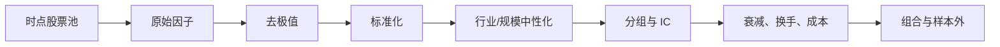

# 14｜因子研究、组合构建与风险管理

> [!WARNING] 风险提示
> 因子历史有效不代表未来有效。组合优化依赖估计值，输入误差会被优化器放大；风险控制只能限制损失路径，不能消除亏损。

## 学习目标

1. 完成因子清洗、横截面排序、分组收益和 IC 检验。
2. 理解去极值、标准化和行业中性化的作用。
3. 构建等权、分数加权和简化风险预算组合。
4. 设置单票、行业、换手、流动性和波动率约束。
5. 运行回撤、流动性和历史情景压力测试。

## 目录

- [1. 因子是什么](#1-因子是什么)
- [2. 标准因子研究流水线](#2-标准因子研究流水线)
- [3. 分组收益与 IC](#3-分组收益与-ic)
- [4. 中性化与因子衰减](#4-中性化与因子衰减)
- [5. 从分数到组合](#5-从分数到组合)
- [6. 组合风险约束](#6-组合风险约束)
- [7. 压力测试](#7-压力测试)
- [8. 可运行示例](#8-可运行示例)
- [9. 排错与验收](#9-排错与验收)

## 1. 因子是什么

因子是对每只证券在某个历史时点计算的数值，用来描述某种特征。

| 因子 | 示例定义 | 可能方向 |
|---|---|---|
| 价值 | 盈利收益率 $E/P$ | 越高越便宜 |
| 质量 | ROE、现金流质量 | 越高越好 |
| 动量 | 过去 120 日收益 | 越高趋势越强 |
| 低波动 | 过去 60 日波动率 | 越低风险可能越小 |
| 规模 | 总市值对数 | 描述大小盘暴露 |

因子值不等于交易信号。研究要检验它与未来收益的横截面关系。

> [!IMPORTANT] 量化重点
> 每个因子必须有数据可得时间、公式、方向、单位、窗口、缺失规则和版本号。

## 2. 标准因子研究流水线



### 2.1 去极值

极端值可能来自真实公司，也可能来自分母接近零或数据错误。温莎化示例：

```python
def winsorize_by_date(df, column, lower=0.01, upper=0.99):
    def clip(group):
        low = group[column].quantile(lower)
        high = group[column].quantile(upper)
        group[column + "_winsor"] = group[column].clip(low, high)
        return group
    return df.groupby("date", group_keys=False).apply(clip)
```

不要在全时间样本上计算分位数，否则会泄漏未来分布。

### 2.2 横截面标准化

在同一天：

$$
z_{i,t}=\frac{x_{i,t}-\bar{x}_t}{s_t}
$$

```python
features["factor_z"] = features.groupby("date")["factor"].transform(
    lambda s: (s - s.mean()) / s.std(ddof=1)
)
```

若标准差为 0，应输出缺失或 0 并记录，而不是产生无穷值。

## 3. 分组收益与 IC

### 3.1 分组收益

把每个交易日的证券按因子分为 5 组，观察下一期收益：

```python
def assign_quantiles(group, column, groups=5):
    ranked = group[column].rank(method="first")
    group["quantile"] = pd.qcut(ranked, groups, labels=False) + 1
    return group

research = features.groupby("date", group_keys=False).apply(
    assign_quantiles,
    column="factor_z",
    groups=5,
)
group_return = research.groupby(["date", "quantile"])[
    "forward_return"
].mean()
```

高减低组合：

$$
R_{H-L,t}=R_{Q5,t}-R_{Q1,t}
$$

检查收益是否大致单调，而不只看首尾两组。

### 3.2 IC

信息系数是因子值与未来收益的横截面相关：

$$
IC_t=Corr(x_{i,t},r_{i,t+1})
$$

Rank IC 使用秩相关，对异常值更稳健：

```python
ic = research.groupby("date").apply(
    lambda g: g["factor_z"].corr(g["forward_return"], method="spearman")
)
print("平均 Rank IC:", ic.mean())
print("ICIR:", ic.mean() / ic.std(ddof=1))
```

ICIR 的年化口径和频率应明确，不要机械套用。

> [!CAUTION] 回测陷阱
> `forward_return` 只能作为标签用于评估，绝不能出现在同日因子的计算、筛选或标准化中。

## 4. 中性化与因子衰减

### 4.1 为什么中性化

假设低 PE 组几乎全是银行，因子收益可能只是行业收益。可以在行业内排名，或回归剔除行业和规模暴露。

简化回归：

$$
x_i=\alpha+\beta\log(MarketCap_i)+\sum_j\gamma_jIndustry_{i,j}+\epsilon_i
$$

残差 $\epsilon_i$ 作为中性化因子。

### 4.2 因子衰减

分别计算未来 1、5、10、20 日 IC 或分组收益。若信号只在 1 日有效但策略每月调仓，研究设计不匹配。

### 4.3 因子换手

比较相邻调仓日股票排名或目标权重。高预测力但排名每天剧烈变化的因子，成本后可能不可用。

## 5. 从分数到组合

### 5.1 等权

选择 $N$ 只股票：

$$
w_i=\frac{1}{N}
$$

透明、稳健，是重要基线。

### 5.2 正分数加权

$$
w_i=\frac{\max(score_i,0)}{\sum_j\max(score_j,0)}
$$

仍需单票上限和现金缓冲。

### 5.3 逆波动率

$$
w_i=\frac{1/\sigma_i}{\sum_j1/\sigma_j}
$$

它降低高波动资产权重，但历史低波动不等于未来安全。

### 5.4 均值方差优化的边界

经典形式：

$$
\max_w\quad w^\top\mu-\lambda w^\top\Sigma w
$$

约束例如：

$$
\sum_iw_i=1,\quad 0\le w_i\le 10\%
$$

$\mu$ 和 $\Sigma$ 都是估计值，微小误差可能导致极端权重。初学项目先把等权作为基准，再引入收缩估计和约束优化。

## 6. 组合风险约束

### 6.1 常用事前限制

- 单票权重不超过 5% 或 10%。
- 单行业主动权重不超过阈值。
- 总股票仓位上限。
- 单次调仓换手上限。
- 低流动性证券权重上限。
- 单日订单不超过历史成交量的一定比例。

这些数值只作研究参数，不能视为通用安全标准。

### 6.2 波动率目标

若当前组合预测波动率 $\hat{\sigma}_p$ 高于目标 $\sigma^*$，缩放系数：

$$
k=\min\left(1,\frac{\sigma^*}{\hat{\sigma}_p}\right)
$$

将股票权重乘以 $k$，剩余放现金。波动率估计会滞后，在突发风险时不能保证立即保护。

### 6.3 回撤控制

回撤阈值控制可能降低风险，也可能在底部卖出并错过反弹。必须预先定义：

- 观察净值是毛还是净。
- 阈值和恢复条件。
- 降仓速度。
- 无法卖出时的处理。

### 6.4 流动性

简化参与率：

$$
Participation=\frac{OrderAmount}{AverageDailyAmount}
$$

参与率越高，冲击成本通常越不能忽略。

## 7. 压力测试

压力测试不是预测某天一定发生，而是问“若发生，会怎样”。

### 7.1 历史情景

- 市场单日大跌。
- 流动性快速收缩。
- 某行业连续下跌。
- 波动率突然升高。

### 7.2 假设情景

| 情景 | 冲击 |
|---|---|
| 市场冲击 | 全部股票 -8% |
| 行业冲击 | 最大行业 -15% |
| 流动性冲击 | 滑点扩大 5 倍 |
| 成交冲击 | 50% 卖单延迟 3 日 |
| 数据冲击 | 关键数据源缺失 2 日 |

组合一阶损失近似：

$$
\Delta V\approx V\sum_iw_iShock_i
$$

非线性产品和真实冲击需要更复杂模型。

> [!WARNING] 风险提示
> 止损、分散和波动率控制都不能保证不亏损；涨跌停和停牌可能使风险动作无法执行。

## 8. 可运行示例

```python
import pandas as pd

snapshot = pd.DataFrame({
    "symbol": ["A.SH", "B.SZ", "C.SH", "D.SZ"],
    "industry": ["银行", "银行", "制造", "医药"],
    "factor": [1.2, 0.8, 1.5, 0.4],
    "volatility": [0.18, 0.22, 0.30, 0.16],
})

snapshot["score"] = snapshot["factor"].clip(lower=0)
snapshot["raw_weight"] = snapshot["score"] / snapshot["score"].sum()
snapshot["capped_weight"] = snapshot["raw_weight"].clip(upper=0.35)
snapshot["target_weight"] = (
    snapshot["capped_weight"] / snapshot["capped_weight"].sum()
)

industry_weight = snapshot.groupby("industry")["target_weight"].sum()
if (industry_weight > 0.50).any():
    raise ValueError("行业集中度超过教学上限")

snapshot["market_shock_pnl"] = (
    snapshot["target_weight"] * -0.08
)
print(snapshot)
print("市场 -8% 的一阶组合冲击:", snapshot["market_shock_pnl"].sum())
```

注意：简单 `clip` 后再归一化可能再次让某些权重超过上限。正式实现需要迭代再分配算法或优化器，这正是应编写单元测试的地方。

## 9. 排错与验收

### 分组数量不足

股票数少、重复值多时 `qcut` 可能失败。检查样本数，采用秩排序并记录实际组数。

### 因子 IC 很高但组合不赚钱

检查方向、调仓频率、覆盖率、权重、成本、行业暴露和可成交性。

### 优化器输出极端集中

输入收益估计不稳定或约束不足。先与等权比较，加入上限和收缩，不要盲信数学最优。

### 风险模型在危机中失效

历史相关性和波动率可能突然变化。加入压力情景而非只依赖单一协方差矩阵。

> [!TIP] 工程验收
> - 因子值与未来收益严格分离。
> - 每个日期独立去极值和标准化。
> - 分组、IC、衰减、覆盖率与换手同时报告。
> - 权重和、单票、行业、现金和流动性约束自动校验。
> - 至少有历史、成本、流动性和无法成交四类压力情景。

## 本章总结

因子研究发现横截面关系，组合构建把多个观点变为资金权重，风险管理限制暴露和脆弱性。它们是一条连续链，不能只挑最赚钱的一段。

## 自测题

1. 因子为什么要按每个日期横截面标准化？
2. 高 IC 为什么不保证组合赚钱？
3. 优化器为何容易产生极端权重？
4. 压力测试与预测有何区别？

<details>
<summary>展开参考答案</summary>

1. 避免未来分布泄漏，并使同日证券具有可比尺度。
2. 成本、换手、权重、约束、覆盖率和成交都可能削弱结果。
3. 预期收益和协方差估计误差会被优化放大，约束不足时尤其明显。
4. 压力测试是假设冲击并评估承受能力，不声称该情景一定发生。

</details>

## 下一章

下一章把趋势、均值回归和基本面多因子放进统一研究模板：[第 15 章 经典策略综合实战](./15-趋势均值回归与多因子实战.md)。

## 贯穿案例检查点：组合生成后的五个断言

```python
tol = 1e-8
assert (weights >= -tol).all()
assert weights.sum() <= 1.0 + tol
assert weights.max() <= single_name_cap + tol
assert industry_weights.max() <= industry_cap + tol
assert expected_turnover <= turnover_cap + tol
```

若允许现金，权重和可以小于 1；若允许卖空或杠杆，需要替换断言并显式记录总敞口和净敞口。

### 风险不是一个数字

对同一组合同时问：

| 风险维度 | 问题 |
|---|---|
| 市场 | 大盘下跌时损失多少 |
| 集中度 | 最大单票和行业是谁 |
| 流动性 | 几天可能完成退出 |
| 模型 | 因子关系失效会怎样 |
| 数据 | 数据延迟或错误会怎样 |
| 执行 | 跌停、停牌时能否降仓 |

> [!WARNING] 风险提示
> 风险约束通过测试只表示模型内满足条件，不代表现实中一定能按模型价格退出。
