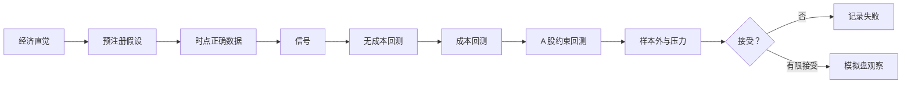

# 15｜经典策略综合实战：趋势、均值回归与多因子

> [!WARNING] 风险提示
> 以下策略都可能长期失效或遭遇大幅回撤，示例只用于学习研究流程。不要因为教学回测盈利就投入真实资金。

## 学习目标

1. 用统一模板研究趋势、均值回归和基本面多因子策略。
2. 理解三类策略依赖的市场假设和典型失效环境。
3. 完成无成本、加成本、加 A 股约束的三层对照。
4. 用基准和样本外结果决定接受、修改或拒绝假设。
5. 形成可复现的策略研究报告。

## 目录

- [1. 统一研究模板](#1-统一研究模板)
- [2. 趋势与动量](#2-趋势与动量)
- [3. 均值回归](#3-均值回归)
- [4. 基本面多因子](#4-基本面多因子)
- [5. 端到端实验](#5-端到端实验)
- [6. 三类策略如何失效](#6-三类策略如何失效)
- [7. 研究报告模板](#7-研究报告模板)
- [8. 工程验收](#8-工程验收)

## 1. 统一研究模板

三类策略都要经历同一闭环：



统一记录：

- 策略版本与代码提交。
- 数据快照与字段说明。
- 股票池、基准和样本切分。
- 信号、仓位、成交与费用。
- 拒绝条件和全部试验结果。

> [!IMPORTANT] 量化重点
> 不同策略使用同一评估框架，才能避免对喜欢的策略放宽标准。

## 2. 趋势与动量

### 2.1 经济直觉

价格趋势可能来自信息缓慢扩散、投资者行为延续和资金流。但趋势也可能突然反转。

### 2.2 时间序列均线趋势

信号：

$$
Signal_t=
\begin{cases}
1,&MA_{fast,t}>MA_{slow,t}\\
0,&otherwise
\end{cases}
$$

```python
def trend_signal(close, fast=20, slow=60):
    if not 0 < fast < slow:
        raise ValueError("必须满足 0 < fast < slow")
    fast_ma = close.rolling(fast, min_periods=fast).mean()
    slow_ma = close.rolling(slow, min_periods=slow).mean()
    return (fast_ma > slow_ma).astype(int)
```

### 2.3 横截面动量

为了减少短期反转干扰，可跳过最近 $s$ 日：

$$
Momentum_{t}(L,s)=\frac{P_{t-s}}{P_{t-L}}-1
$$

其中 $L>s>0$。

```python
def cross_sectional_momentum(bars, lookback=120, skip=5):
    grouped = bars.groupby("symbol")["adjusted_close"]
    older = grouped.shift(lookback)
    recent = grouped.shift(skip)
    return recent / older - 1
```

在每个调仓日按动量排名，选择前若干比例，并在下一交易日执行。

### 2.4 典型风险

- 震荡市场反复假突破。
- 趋势急剧反转。
- 高换手和滑点。
- 强者组集中于同一行业。
- 涨停股票理论上最强但买不到。

## 3. 均值回归

### 3.1 经济直觉

短期价格偏离可能由流动性冲击、过度反应或暂时供需造成，随后回归常态。但“跌得多”也可能是基本面恶化。

### 3.2 标准化偏离

$$
z_t=\frac{P_t-MA_t(n)}{SD_t(n)}
$$

示例规则：

- $z_t<-2$：产生候选买入信号。
- $z_t>0$：退出。

```python
def mean_reversion_signal(close, window=20, entry=-2.0, exit=0.0):
    mean = close.rolling(window, min_periods=window).mean()
    std = close.rolling(window, min_periods=window).std(ddof=1)
    zscore = (close - mean) / std.replace(0, float("nan"))

    signal = pd.Series(index=close.index, dtype=float)
    holding = 0
    for index, z in zscore.items():
        if pd.isna(z):
            signal.loc[index] = 0
        elif holding == 0 and z < entry:
            holding = 1
            signal.loc[index] = 1
        elif holding == 1 and z > exit:
            holding = 0
            signal.loc[index] = 0
        else:
            signal.loc[index] = holding
    return signal
```

这里用状态循环，因为“进入”和“退出”阈值不同，单个布尔表达式无法完整表示持仓状态。

### 3.3 配对思路

对两个具有稳定经济联系的价格序列 $A$ 和 $B$，构造价差：

$$
Spread_t=\log P_{A,t}-\beta\log P_{B,t}
$$

再检验价差是否稳定。仅凭历史相关性高不代表价差均值回归；结构关系可能断裂。统计套利还面临融券可得性、成本和卖空约束，本教程只做理论入门，不实现真实卖空交易。

### 3.4 典型风险

- 把基本面永久恶化误当暂时偏离。
- 抄底后连续跌停无法退出。
- 参数依赖特定波动阶段。
- 小收益高胜率被一次尾部亏损吞噬。

## 4. 基本面多因子

### 4.1 因子定义

教学组合：

- 质量：ROE、经营现金流与利润比。
- 价值：盈利收益率或账面市值比。
- 成长：收入同比增长。
- 动量：过去 120 日收益，跳过最近 5 日。

综合分数：

$$
Score=0.30Quality+0.25Value+0.20Growth+0.25Momentum
$$

权重只是预先约定的教学参数，不是从历史反复调出来的“最优值”。

### 4.2 时间正确连接

```python
visible = fundamentals[
    fundamentals["available_date"] <= decision_date
].copy()
latest = (
    visible.sort_values(["symbol", "available_date"])
    .groupby("symbol", as_index=False)
    .tail(1)
)
snapshot = market_snapshot.merge(
    latest,
    on="symbol",
    how="inner",
    validate="one_to_one",
)
```

> [!CAUTION] 回测陷阱
> 任何财务字段若没有可得日期，都不能默认在报告期末可知。宁可使用保守延迟，也不要制造提前知道财报的策略。

### 4.3 行业内标准化

```python
factor_columns = ["quality", "value", "growth", "momentum"]
for column in factor_columns:
    snapshot[column + "_z"] = snapshot.groupby("industry")[column].transform(
        lambda s: (s - s.mean()) / s.std(ddof=1)
    )

snapshot["score"] = (
    0.30 * snapshot["quality_z"]
    + 0.25 * snapshot["value_z"]
    + 0.20 * snapshot["growth_z"]
    + 0.25 * snapshot["momentum_z"]
)
```

行业样本太少时标准差可能为空，需要设置最小行业样本数或改用全市场标准化加行业约束。

## 5. 端到端实验

### 5.1 实验问题

比较三种策略在同一股票池、区间、基准和费用假设下的结果，而不是让每个策略选择对自己最有利的样本。

### 5.2 数据流

```text
instruments.csv → 历史股票池
bars.csv → 价格、动量、波动率、成交
fundamentals.csv → 质量、价值、成长
corporate_actions.csv → 总收益与账户调整
```

### 5.3 三层回测

```python
scenarios = [
    {"name": "ideal", "cost": False, "a_share_constraints": False},
    {"name": "with_cost", "cost": True, "a_share_constraints": False},
    {"name": "constrained", "cost": True, "a_share_constraints": True},
]

rows = []
for scenario in scenarios:
    result = run_strategy_experiment(
        strategy=strategy,
        provider=provider,
        scenario=scenario,
    )
    rows.append({
        "scenario": scenario["name"],
        **result.metrics,
        "fills": len(result.fills),
        "rejections": len(result.rejections),
    })

comparison = pd.DataFrame(rows)
print(comparison)
```

`run_strategy_experiment` 是你需要在综合项目中完成的统一入口。它的价值在于强迫三种策略复用相同数据、回测和报告组件。

### 5.4 研究结论的三种状态

- 拒绝：样本外无效、成本后无意义或存在无法修复的偏差。
- 暂时保留：结果有解释且稳健，但仍需模拟盘。
- 重新设计：发现实现或假设问题，注册新版本，不覆盖旧结果。

## 6. 三类策略如何失效

| 策略 | 适合的可能环境 | 典型失效 |
|---|---|---|
| 趋势 | 持续单边行情 | 震荡反复止损、突然反转 |
| 均值回归 | 稳定区间、暂时冲击 | 结构断裂、连续下跌 |
| 多因子 | 因子溢价较稳定 | 风格拥挤、财务泄漏、行业偏离 |

不要在看到市场状态后才事后宣称“这个阶段本来就不适合”，除非状态判断规则在回测前就能实时计算。

### 共同失败源

- 当前股票池回测历史。
- 同日收盘信号同日收盘成交。
- 忽略退市、停牌和涨跌停。
- 过低成本和无限流动性。
- 反复调参。

## 7. 研究报告模板

每次实验保存：

```yaml
experiment_id: ma-001
hypothesis: fast_ma_above_slow_ma
data_snapshot: teaching-v1
universe_version: pit-v1
train: 2018-01-01/2021-12-31
validation: 2022-01-01/2023-12-31
test: 2024-01-01/2025-12-31
execution: next_open
cost_model: a-share-teaching-v1
constraints: t1-limit-suspension-lot-v1
code_commit: example
decision: pending
```

报告正文包括：

1. 经济直觉与拒绝条件。
2. 数据来源和可得时间。
3. 公式、参数与执行顺序。
4. 毛、净、受约束三种结果。
5. 基准、归因和压力测试。
6. 所有失败与例外。
7. 是否进入模拟盘及理由。

## 8. 工程验收

> [!TIP] 工程验收
> - 三种策略复用同一 DataProvider、订单、回测和绩效模块。
> - 每种策略有至少一个手算小样本单元测试。
> - 全部实验参数和结果持久化，不覆盖失败实验。
> - 报告明确样本外区间和成本口径。
> - 无成本 → 加成本 → 加约束的变化可逐笔解释。

## 本章总结

趋势、均值回归和多因子依赖不同直觉，却应接受相同研究纪律。策略实战的目标不是挑出历史冠军，而是建立一条能拒绝错误、记录失败、逐层接近现实的流程。

## 自测题

1. 横截面动量为什么常跳过最近几日？
2. 均值回归高胜率为何仍可能危险？
3. 多因子最容易出现哪类时间泄漏？
4. 为什么三种策略应使用相同股票池和样本比较？

<details>
<summary>展开参考答案</summary>

1. 用于减少极短期反转或微观结构影响，具体设定仍需检验。
2. 少数结构性崩溃或连续跌停可能吞噬大量小利润。
3. 财报按报告期末而非真实公告可得日进入特征。
4. 否则结果差异可能来自样本选择而非策略本身。

</details>

## 下一章

下一章学习如何让机器学习遵守同样严格的时间与回测纪律：[第 16 章 机器学习量化入门](./16-机器学习量化入门.md)。

## 贯穿案例检查点：先写“停止研究”的条件

在运行前填写：

```yaml
reject_if:
  - test_excess_return_is_not_positive
  - performance_depends_on_one_year
  - cost_x2_removes_all_advantage
  - neighboring_parameters_reverse_result
  - unexplainable_data_leakage_detected
paper_trade_only_if:
  - all_point_in_time_checks_pass
  - constrained_backtest_is_reproducible
  - risk_limits_pass
```

条件应在看到测试集前确定。若结果失败，保存失败实验；不要改一个参数后覆盖原记录。

### 策略对照卡

| 问题 | 趋势 | 均值回归 | 多因子 |
|---|---|---|---|
| 信号来源 | 价格延续 | 短期偏离 | 横截面特征 |
| 常见持有期 | 中短期 | 较短 | 调仓周期较长 |
| 最大隐患 | 反转和震荡 | 结构断裂 | 泄漏和风格拥挤 |
| 必查成本 | 反复换手 | 高频小利润 | 调仓和冲击 |

> [!IMPORTANT] 量化重点
> 一次诚实的失败研究比一条经过反复筛选的漂亮曲线更有价值，因为它保护你不把噪声当规律。
