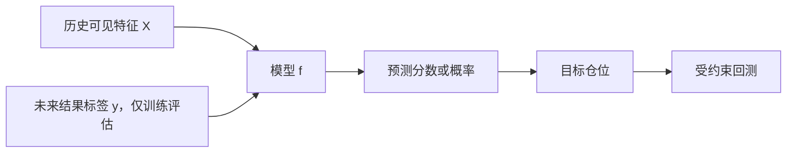

# 16｜机器学习量化入门：特征、标签与时间验证

> [!WARNING] 风险提示
> 机器学习不会自动发现稳定盈利规律。金融信号弱、环境变化快、噪声大，复杂模型更容易隐藏泄漏和过拟合。

## 学习目标

1. 区分特征、标签、样本、模型和预测。
2. 构造不泄漏未来的收益标签。
3. 使用按时间切分的训练、验证和测试集。
4. 从简单基线开始，输出概率或分数再映射为仓位。
5. 检查分类指标、收益指标、成本、漂移和可解释性。

## 目录

- [1. 机器学习在量化中做什么](#1-机器学习在量化中做什么)
- [2. 特征与标签](#2-特征与标签)
- [3. 时间切分和预处理](#3-时间切分和预处理)
- [4. 建立简单基线](#4-建立简单基线)
- [5. 从预测到组合](#5-从预测到组合)
- [6. 评估与回测](#6-评估与回测)
- [7. 泄漏、漂移与过拟合](#7-泄漏漂移与过拟合)
- [8. 完整教学示例](#8-完整教学示例)
- [9. 排错与验收](#9-排错与验收)

## 1. 机器学习在量化中做什么

监督学习流程：



例如：

- 输入：过去动量、波动率、ROE、估值、行业。
- 标签：未来 5 日收益是否为正。
- 输出：上涨概率。
- 交易：只选择概率最高且满足风险约束的股票。

模型不是订单系统。它只输出估计，还需经过仓位、成本和成交约束。

> [!IMPORTANT] 量化重点
> 先构建“永远预测平均值”或简单线性模型基线。复杂模型只有在严格样本外、成本后稳定改善时才有价值。

## 2. 特征与标签

### 2.1 特征

在决策日 $t$ 可见的输入：

$$
X_{i,t}=[Momentum_{i,t},Volatility_{i,t},ROE_{i,t},\ldots]
$$

每个特征都需满足：

$$
available\_time(X_{i,t})\le decision\_time_t
$$

### 2.2 回归标签

未来 $h$ 日收益：

$$
y_{i,t}=\frac{P_{i,t+h}}{P_{i,t}}-1
$$

```python
horizon = 5
data["future_return_5d"] = (
    data.groupby("symbol")["adjusted_close"].shift(-horizon)
    / data["adjusted_close"]
    - 1
)
```

`shift(-horizon)` 使用未来数据是因为它只构造训练标签，不得进入特征。

### 2.3 分类标签

```python
data["target_up"] = (data["future_return_5d"] > 0).astype(int)
```

最后 $h$ 天没有完整未来标签，必须从训练样本删除。

### 2.4 横截面标签

预测绝对涨跌往往受市场整体影响。也可以预测同日未来收益排名：

```python
data["target_rank"] = data.groupby("date")["future_return_5d"].rank(pct=True)
```

## 3. 时间切分和预处理

### 3.1 不要随机切分

```python
#金融时间序列通常不应这样做
train_test_split(X, y, test_size=0.2, shuffle=True)
```

随机打乱会让未来市场状态进入训练。

### 3.2 按日期切分

```python
train = data[data["date"] <= "2022-12-31"].copy()
validation = data[
    (data["date"] >= "2023-01-01")
    & (data["date"] <= "2024-12-31")
].copy()
test = data[data["date"] >= "2025-01-01"].copy()
```

### 3.3 标签重叠与间隔

若标签使用未来 20 日收益，训练集末尾样本的标签可能跨入验证期。可以在边界设置至少 20 个交易日的隔离区，避免标签信息重叠。

### 3.4 预处理只能拟合训练集

```python
from sklearn.preprocessing import StandardScaler

feature_columns = ["momentum_20", "volatility_20", "roe"]
scaler = StandardScaler()
X_train = scaler.fit_transform(train[feature_columns])
X_valid = scaler.transform(validation[feature_columns])
X_test = scaler.transform(test[feature_columns])
```

不能对全数据 `fit_transform` 后再切分。

### 3.5 使用 Pipeline

```python
from sklearn.impute import SimpleImputer
from sklearn.linear_model import LogisticRegression
from sklearn.pipeline import Pipeline
from sklearn.preprocessing import StandardScaler

model = Pipeline([
    ("imputer", SimpleImputer(strategy="median")),
    ("scaler", StandardScaler()),
    ("classifier", LogisticRegression(max_iter=1000)),
])
```

Pipeline 能减少训练与预测预处理不一致，但仍不能自动解决时间泄漏。

## 4. 建立简单基线

### 4.1 常数基线

若训练集中 53% 标签为上涨，永远预测上涨的准确率就是 53%。模型准确率 54% 的改善可能很小。

### 4.2 线性或逻辑回归

优点：

- 参数少。
- 训练快。
- 容易解释方向。
- 适合暴露数据问题。

### 4.3 树模型

树模型可表达非线性和交互，但更容易拟合噪声。限制深度、叶节点样本数，并用 Walk-forward 检验。

### 4.4 不以深度学习为起点

样本行数多不等于独立信息多。相邻日期和股票收益高度相关，有效样本量远小于表面行数。

## 5. 从预测到组合

模型输出上涨概率 $p_{i,t}$。最简单做法：

```python
prediction["score"] = prediction["probability_up"] - 0.5
prediction["rank"] = prediction.groupby("date")["score"].rank(pct=True)
prediction["selected"] = prediction["rank"] >= 0.90
```

再生成等权目标：

```python
selected_count = prediction.groupby("date")["selected"].transform("sum")
prediction["target_weight"] = (
    prediction["selected"].astype(float)
    / selected_count.replace(0, float("nan"))
).fillna(0.0)
```

还需：

- 单票和行业上限。
- 流动性过滤。
- 换手限制。
- 下一交易日执行。
- A 股约束和费用。

概率未校准时，0.7 不一定代表真实 70% 胜率。排名有时比绝对概率更稳健，但仍需检验。

## 6. 评估与回测

### 6.1 机器学习指标

- 分类：准确率、精确率、召回率、ROC-AUC、对数损失。
- 回归：MAE、MSE、秩相关。
- 概率：校准曲线和 Brier 分数。

### 6.2 金融指标

- 分组未来收益和 Rank IC。
- 成本后年化收益和最大回撤。
- 换手和成交率。
- 行业、规模与风格暴露。
- 分年度和 Walk-forward 稳定性。

模型 AUC 更高不一定更赚钱，因为改善可能发生在不会交易的样本，或需要过高换手。

### 6.3 概率阈值也会过拟合

若在测试集上从 0.51 调到 0.63 得到最好收益，测试集已参与调参。阈值应在验证集选择。

## 7. 泄漏、漂移与过拟合

### 7.1 常见泄漏清单

- 用未来收益参与特征选择。
- 全样本填充缺失和标准化。
- 财报按报告期末对齐。
- 当前股票池回测历史。
- 随机打乱切分。
- 测试集反复调参。

### 7.2 概念漂移

$$
P(y|X)_{train}\ne P(y|X)_{future}
$$

市场参与者、制度、产业结构和交易拥挤变化会使关系漂移。

监控：

- 特征分布。
- 缺失率和覆盖率。
- 预测概率分布。
- IC、命中率和成本后收益。
- 行业与风格暴露。

### 7.3 特征重要性不是因果

模型认为某特征重要，只表示它有助于当前预测，不证明变量导致收益。相关特征之间还会互相替代。

> [!CAUTION] 回测陷阱
> 机器学习库会帮你拟合，却不会提醒你财报在当时尚未公布、股票已经退市或订单无法成交。

## 8. 完整教学示例

安装可选依赖：

```powershell
Set-Location <仓库目录>\quant-lab
.\.venv\Scripts\python.exe -m pip install scikit-learn
```

训练逻辑回归：

```python
from sklearn.metrics import roc_auc_score

features = ["momentum_20", "volatility_20", "roe"]
model.fit(train[features], train["target_up"])

valid_probability = model.predict_proba(validation[features])[:, 1]
valid_auc = roc_auc_score(validation["target_up"], valid_probability)
print("验证集 AUC:", round(valid_auc, 4))

#最终选择完成后，测试集只评估一次
test_probability = model.predict_proba(test[features])[:, 1]
test_result = test[["date", "symbol", "future_return_5d"]].copy()
test_result["probability_up"] = test_probability
test_result["rank"] = test_result.groupby("date")[
    "probability_up"
].rank(pct=True)
test_result["selected"] = test_result["rank"] >= 0.90

group_return = test_result.groupby("selected")[
    "future_return_5d"
].mean()
print(group_return)
```

然后把预测日的 `selected` 转为下一交易日目标仓位，交给第 12 章的事件驱动回测。直接平均 `future_return_5d` 只是研究诊断，不是账户级收益。

### 必须保存

```yaml
model: logistic-regression
features:
  - momentum_20
  - volatility_20
  - roe
label: future_return_5d_gt_zero
train_end: 2022-12-31
validation: 2023-01-01/2024-12-31
test_start: 2025-01-01
random_seed: 42
data_snapshot: teaching-v1
```

## 9. 排错与验收

### 训练很好，测试接近随机

可能过拟合或关系漂移。降低复杂度，检查泄漏、样本切分和参数搜索次数。

### AUC 小于 0.5

检查标签方向和概率列；也可能模型稳定预测了相反方向，但不能在看完测试后随意反转。

### 预测中出现 NaN

检查滚动窗口、财务覆盖、停牌和预处理 Pipeline。不要用未来值填充。

### 每次结果不同

固定随机种子、数据排序、依赖版本和并行配置；确定性不等于正确，但有利于排错。

> [!TIP] 工程验收
> - 特征表记录每行最大输入可得时间。
> - 标签列不进入任何特征处理。
> - 预处理只在训练集拟合。
> - 测试集不参与模型、阈值或特征选择。
> - 模型指标和受约束回测指标同时报告。
> - 模型、数据、代码、参数和随机种子可追溯。

## 本章总结

机器学习只是从历史可见特征到预测分数的函数。真正困难的是时间正确的数据、诚实的样本外验证，以及把预测转换为成本后可执行组合。

## 自测题

1. `shift(-5)` 构造未来标签为什么不必然是泄漏？
2. 为什么不应随机切分金融时间序列？
3. AUC 更高为何不一定带来更高净收益？
4. Pipeline 能否自动阻止财报提前可见？

<details>
<summary>展开参考答案</summary>

1. 它只作为训练和评估目标；只要不进入特征或决策即可。
2. 会让未来市场状态和相邻样本信息进入训练。
3. 收益还取决于阈值、排序、权重、换手、成本和成交约束。
4. 不能；可得日期和股票池时间正确性仍需研究者保证。

</details>

## 下一章

下一章把研究能力组织为 Python 后端与 API：[第 17 章 Python 量化平台架构与 API](./17-Python量化平台架构数据库与API.md)。

## 贯穿案例检查点：特征表时间审计

为每行样本增加：

| 字段 | 含义 |
|---|---|
| decision_time | 模型生成预测的时点 |
| feature_max_available_time | 所有特征中最晚可得时间 |
| label_start_time | 标签收益开始时点 |
| label_end_time | 标签收益结束时点 |

自动断言：

```python
assert (
    samples["feature_max_available_time"]
    <= samples["decision_time"]
).all()
assert (
    samples["label_start_time"]
    >= samples["decision_time"]
).all()
```

训练与验证边界还需检查标签区间是否重叠。

### 模型上线前的朴素问题

1. 比永远预测平均值好多少？
2. 改善是否出现在真正交易的样本？
3. 成本翻倍后还剩多少？
4. 哪些特征分布已偏离训练期？
5. 模型输出为空或异常时系统如何保持现金？

> [!TIP] 工程验收
> 模型服务失败时默认不新开仓，并留下错误日志；不得把 NaN、无穷值或异常概率直接转换成订单。
