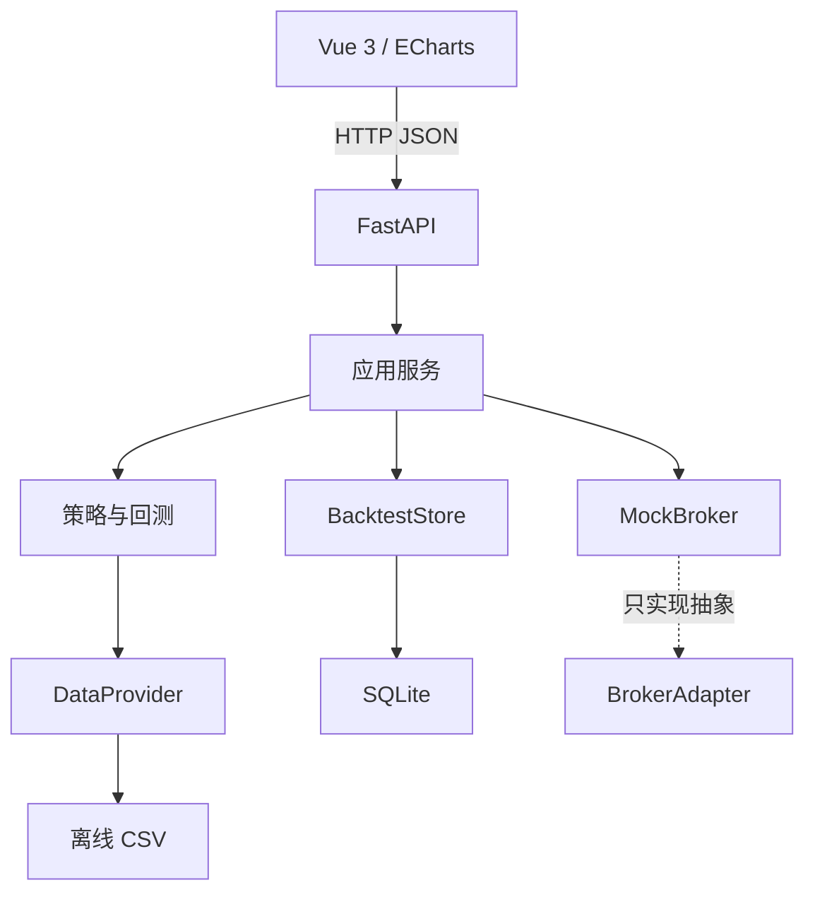
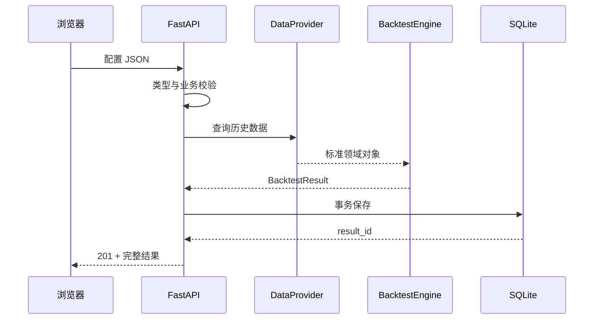

# 17｜Python 量化平台架构、数据库与 FastAPI

> [!WARNING] 风险提示
> 平台只支持离线研究、历史回测和模拟盘。项目不实现真实券商连接，也不发送真实订单。

## 学习目标

1. 理解量化平台的数据流、模块边界和领域对象。
2. 看懂项目的 Python 包目录和依赖方向。
3. 用 SQLAlchemy + SQLite 保存回测结果。
4. 启动 FastAPI 并调用行情、回测、订单和账户接口。
5. 设计参数校验、错误响应、配置和安全边界。

## 项目约定

- 笔记：`docs`。
- 项目：`quant-lab`。
- 后端：全部使用 Python 3.12，不使用 Java、Spring、Maven 或 Gradle。
- 前端：Vue 3 与 ECharts，只负责浏览器界面。
- 模式：单用户、本机、研究和模拟盘。

## 目录

- [1. 最终软件形态](#1-最终软件形态)
- [2. 架构与目录](#2-架构与目录)
- [3. 核心领域对象](#3-核心领域对象)
- [4. 数据、策略和经纪商接口](#4-数据策略和经纪商接口)
- [5. SQLite 持久化](#5-sqlite-持久化)
- [6. FastAPI 接口](#6-fastapi-接口)
- [7. 启动与调用](#7-启动与调用)
- [8. 校验、安全与扩展边界](#8-校验安全与扩展边界)
- [9. 排错与验收](#9-排错与验收)

## 1. 最终软件形态

用户可以在浏览器查看行情，选择策略、股票池、日期、资金和参数，运行回测，查看净值、回撤、成交和绩效，并向虚拟账户提交模拟订单。

明确不做：

- 不连接券商和真实资金。
- 不提供荐股或收益承诺。
- 不公开部署。
- 不让浏览器直接读写数据文件。

## 2. 架构与目录



依赖方向：

- 核心领域层不依赖 FastAPI。
- 策略不依赖 CSV 字段。
- 回测器依赖 `DataProvider` 抽象。
- API 负责校验和调用，不实现指标公式。
- 前端只通过 HTTP 获取数据。

```text
quant-lab
├─ data
├─ src\quant_lab
│  ├─ core\models.py
│  ├─ core\strategy.py
│  ├─ data\provider.py
│  ├─ data\storage.py
│  ├─ backtest\engine.py
│  ├─ backtest\metrics.py
│  ├─ paper\broker.py
│  └─ api\app.py
├─ tests
├─ frontend
├─ pyproject.toml
└─ README.md
```

> [!TIP] 工程验收
> 不启动 Web 服务，也可以直接运行策略、回测和经纪商测试。

## 3. 核心领域对象

| 对象 | 含义 |
|---|---|
| Instrument | 证券身份和市场属性 |
| Bar | 一个交易周期行情 |
| CorporateAction | 分红送转等公司行为 |
| FundamentalRecord | 带可得日期的财务记录 |
| Signal | 策略观点 |
| TargetPosition | 目标仓位 |
| Order | 订单请求与状态 |
| Fill | 成交事实与费用 |
| Position | 总持仓、可卖量、成本 |
| PortfolioSnapshot | 现金、市值、权益 |
| BacktestConfig | 可重放配置 |
| BacktestResult | 快照、成交和指标 |

```python
from dataclasses import dataclass
from datetime import date

@dataclass(frozen=True)
class Bar:
    trading_date: date
    symbol: str
    open: float
    high: float
    low: float
    close: float
    volume: int
    is_suspended: bool = False
    limit_up: float | None = None
    limit_down: float | None = None
```

`frozen=True` 让行情对象创建后不可直接修改，减少策略意外篡改历史数据。

## 4. 数据、策略和经纪商接口

### DataProvider

```python
from abc import ABC, abstractmethod
from datetime import date

class DataProvider(ABC):
    @abstractmethod
    def instruments(self):
        ...

    @abstractmethod
    def bars(self, symbols: list[str], start: date, end: date):
        ...
```

离线 `CsvDataProvider` 和未来联网适配器遵守同一输出语义。

### Strategy

策略输入只能含决策时点可见历史，输出 `Signal` 或 `TargetPosition`，不能直接修改账户：

```python
class Strategy:
    def generate(self, history, trading_date):
        raise NotImplementedError
```

### BrokerAdapter

```python
class BrokerAdapter(ABC):
    @abstractmethod
    def submit(
        self,
        symbol,
        side,
        quantity,
        trading_date,
        limit_price=None,
    ):
        ...
```

项目只实现 `MockBroker`。保留抽象用于边界清晰，不代表会接入实盘。

## 5. SQLite 持久化

项目用 SQLAlchemy 将回测配置、指标、净值和成交序列化为 JSON 存入 SQLite。

```python
from sqlalchemy import Column, Integer, MetaData, String, Table, Text

metadata = MetaData()
results = Table(
    "backtest_results",
    metadata,
    Column("id", Integer, primary_key=True, autoincrement=True),
    Column("strategy", String(64), nullable=False),
    Column("payload", Text, nullable=False),
)
```

事务写入：

```python
with engine.begin() as connection:
    result = connection.execute(
        results.insert().values(
            strategy="moving-average",
            payload=json.dumps(payload, ensure_ascii=False),
        )
    )
```

`engine.begin()` 正常结束时提交，异常时回滚。

教学版存 JSON 的优点是直观、能快速回放完整结果；局限是不便按成交做复杂查询，数据量大时也会膨胀。后续可拆成回测、快照和成交表，但必须做模式迁移。

## 6. FastAPI 接口

| 方法 | 路径 | 作用 |
|---|---|---|
| GET | `/health` | 健康状态和研究模式 |
| GET | `/instruments` | 证券列表 |
| GET | `/bars` | 单只证券行情 |
| GET | `/strategies` | 教学策略 |
| POST | `/backtests` | 创建并保存回测 |
| GET | `/backtests/{id}` | 查询回测结果 |
| GET/POST | `/orders` | 模拟订单 |
| GET | `/portfolio` | 模拟现金和持仓 |

请求模型：

```python
from datetime import date
from pydantic import BaseModel, Field

class BacktestRequest(BaseModel):
    symbols: list[str] = Field(min_length=1)
    start_date: date
    end_date: date
    initial_cash: float = Field(default=1_000_000, gt=0)
    short_window: int = Field(default=3, ge=1, le=60)
    long_window: int = Field(default=5, ge=2, le=250)
```

单字段范围由 Pydantic 校验，跨字段业务规则仍需显式检查：

```python
if request.start_date > request.end_date:
    raise HTTPException(422, "开始日期不能晚于结束日期")
if request.short_window >= request.long_window:
    raise HTTPException(422, "短均线窗口必须小于长均线窗口")
```

常用状态码：

- 200：查询成功。
- 201：创建成功。
- 404：行情或回测不存在。
- 422：字段或业务参数无效。
- 500：未预期错误，内部记录日志。

错误响应不能泄露本地路径、令牌或完整堆栈。

## 7. 启动与调用

### 建立环境

```powershell
Set-Location <仓库目录>\quant-lab
py -3.12 -m venv .venv
.\.venv\Scripts\Activate.ps1
python -m pip install -e ".[dev]"
```

若 `py -3.12` 不可用，用已安装的 Python 3.12 完整路径，并先确认版本。

### 启动

```powershell
uvicorn quant_lab.api.app:app --reload
```

打开：

- `http://127.0.0.1:8000/docs`：OpenAPI 页面。
- `http://127.0.0.1:8000/health`：健康检查。
- `http://127.0.0.1:8000/`：教学前端。

### 查询行情

```powershell
$query = @{
    symbol = "600000.SH"
    start_date = "2024-01-01"
    end_date = "2026-12-31"
}
Invoke-RestMethod -Uri "http://127.0.0.1:8000/bars" -Body $query
```

### 创建回测

```powershell
$body = @{
    symbols = @("600000.SH")
    start_date = "2024-01-01"
    end_date = "2026-12-31"
    initial_cash = 100000
    short_window = 3
    long_window = 5
} | ConvertTo-Json

$result = Invoke-RestMethod -Method Post -Uri "http://127.0.0.1:8000/backtests" -ContentType "application/json" -Body $body
$result.id
$result.metrics
```

若证券或日期不同，先查询 `/instruments` 和 `/bars`，不要猜测。

## 8. 校验、安全与扩展边界

### 输入校验

- 股票池非空且证券存在。
- 开始日不晚于结束日。
- 初始资金为正且有合理上限。
- 短窗口小于长窗口。
- 日期范围不能无限扩大。
- 订单数量和价格满足规则。

### 配置与密钥

联网数据令牌通过环境变量或本地忽略配置读取，不写入源码、笔记、日志和前端。

### 并发状态

当前 `MockBroker` 是进程内单例，适合单用户教学。多用户或多进程会造成状态混淆；扩展前必须增加账户 ID、数据库事务、并发控制和权限。

### 长任务

同步教学回测足够简单。长回测需要任务状态：

```text
PENDING → RUNNING → SUCCEEDED
                  ↘ FAILED
```

失败任务保存错误摘要和配置，不能让页面无限等待。

## 9. 排错与验收

### `ModuleNotFoundError: quant_lab`

在项目根目录执行 `python -m pip install -e ".[dev]"`，确认安装和启动使用同一解释器。

### 端口被占用

```powershell
uvicorn quant_lab.api.app:app --port 8001
```

### 回测返回 404

查询证券列表和行情范围。404 可能表示区间确实无教学数据。

### SQLite 被锁

检查是否多个服务进程同时写入。教学项目使用单进程；并发系统需重新设计存储。

### 页面能开但 API 失败

先直接访问 `/health` 和 `/docs`，确认后端，再检查浏览器网络请求。

> [!TIP] 工程验收
> - `pytest` 能在不启动服务时测试核心模块。
> - `/health` 返回 `research-and-paper-only`。
> - 非法日期、资金、窗口和证券得到稳定错误码。
> - 回测 ID 可读取与创建时一致的结果。
> - 项目无 Java、真实券商 SDK 和明文密钥。

## 本章总结

量化软件的关键不是把代码塞进一个 API 文件，而是让数据、策略、回测、账本、存储和 Web 各司其职。Python 后端统一领域语义，FastAPI 只把能力安全地提供给本地前端。

## 自测题

1. 为什么策略层不应依赖 FastAPI 或 CSV 字段？
2. `engine.begin()` 有什么帮助？
3. Pydantic 校验范围后，为何仍需跨字段校验？
4. 当前 `MockBroker` 为什么不适合多用户？

<details>
<summary>展开参考答案</summary>

1. 否则核心研究逻辑与传输或供应商耦合，难测试和替换。
2. 提供事务边界，正常提交、异常回滚。
3. 单字段合法不代表组合合理，例如短窗口可能大于长窗口。
4. 它是进程内共享状态，没有账户隔离、持久事务和并发控制。

</details>

## 下一章

最后一章完成前端、模拟盘、测试、复现和端到端验收：[第 18 章 Web 平台综合实战](./18-Vue前端模拟盘测试与综合验收.md)。

## 贯穿案例检查点：一次 API 请求的完整路径

`POST /backtests` 不只是“调用一个函数”：



任一环节失败都要转换为稳定错误：

- 请求非法：422。
- 数据不存在：404。
- 数据源或回测内部失败：日志记录实验配置，返回不泄密的错误。
- 数据库写入失败：事务回滚，不返回虚假成功 ID。

> [!TIP] 工程验收
> API 测试不仅断言状态码，还断言错误正文、数据库是否写入以及失败后服务能否继续响应 `/health`。
