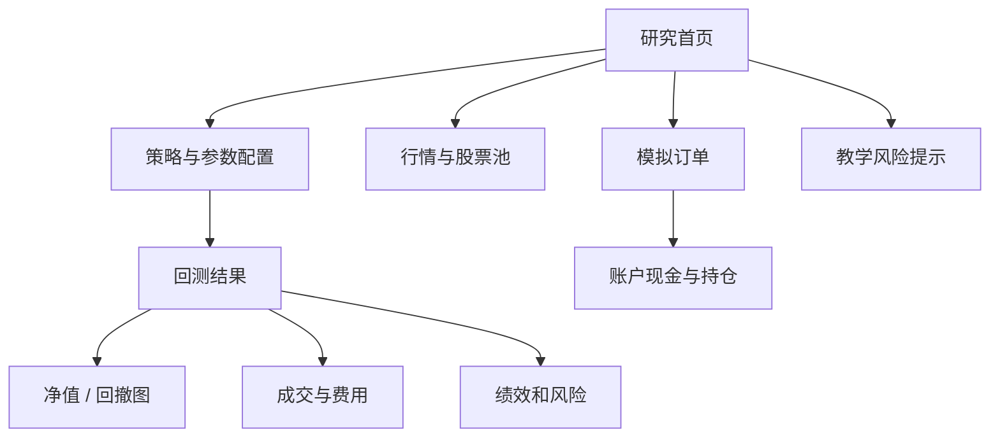
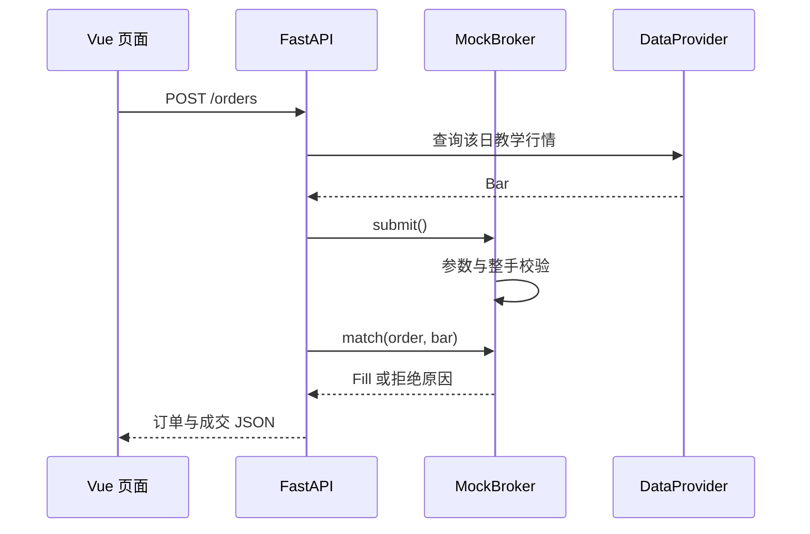
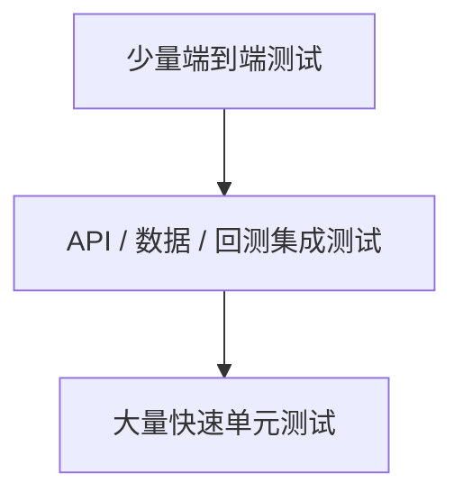

# 18｜Vue 前端、模拟盘、测试与综合验收

> [!WARNING] 风险提示
> 本章完成的是本地教学平台。模拟成交不代表真实可成交，系统不连接券商、不处理真实资金，页面中的收益和股票只用于教学。

## 学习目标

1. 用 Vue 3 调用 Python API，并用 ECharts 展示净值和回撤。
2. 理解模拟订单、成交、持仓和日终结算的生命周期。
3. 建立单元测试、集成测试、日志和可复现研究记录。
4. 从导入数据到生成报告完成端到端演示。
5. 按明确清单判断项目是否真正完成。

## 前置条件

- 完成 [第 17 章](./17-Python量化平台架构数据库与API.md)。
- 项目位于 `quant-lab`。
- 已安装 Python 3.12；构建前端还需 Node.js。
- 所有测试均使用教学数据和模拟账户。

## 目录

- [1. 页面信息架构](#1-页面信息架构)
- [2. Vue 调用 Python API](#2-vue-调用-python-api)
- [3. ECharts 净值与回撤](#3-echarts-净值与回撤)
- [4. 模拟盘订单生命周期](#4-模拟盘订单生命周期)
- [5. 测试金字塔](#5-测试金字塔)
- [6. 日志、安全与复现](#6-日志安全与复现)
- [7. 从零启动完整平台](#7-从零启动完整平台)
- [8. 端到端验收任务](#8-端到端验收任务)
- [9. 常见故障排查](#9-常见故障排查)
- [10. 毕业检查单](#10-毕业检查单)

## 1. 页面信息架构

最小平台包含：



每个结果页应始终展示：

- 策略与版本。
- 股票池和样本日期。
- 初始资金与费用。
- 执行时点和 A 股约束。
- 数据快照。
- “非投资建议、非真实成交”提示。

> [!TIP] 工程验收
> 页面刷新后能通过回测 ID 重新加载结果，而不是只依赖浏览器内存。

## 2. Vue 调用 Python API

`frontend\src\App.vue` 使用 Vue 3 Composition API：

```javascript
import { nextTick, onMounted, ref } from 'vue'

const instruments = ref([])
const result = ref(null)
const error = ref('')
const loading = ref(false)

onMounted(async () => {
  const response = await fetch('/instruments')
  if (!response.ok) {
    throw new Error('证券列表加载失败')
  }
  instruments.value = await response.json()
})
```

`ref` 创建响应式状态；值变化后，模板自动更新。

### 发起回测

```javascript
async function runBacktest() {
  loading.value = true
  error.value = ''
  try {
    const response = await fetch('/backtests', {
      method: 'POST',
      headers: {'Content-Type': 'application/json'},
      body: JSON.stringify({
        symbols: instruments.value.map(item => item.symbol),
        start_date: '2025-01-02',
        end_date: '2025-01-17',
        initial_cash: 100000,
        short_window: 3,
        long_window: 5
      })
    })
    const body = await response.json()
    if (!response.ok) {
      throw new Error(body.detail ?? '回测失败')
    }
    result.value = body
    await nextTick()
    renderEquityChart(body)
  } catch (exception) {
    error.value = exception.message
  } finally {
    loading.value = false
  }
}
```

`try / catch / finally` 保证失败时显示错误，并且按钮不会永远停在“运行中”。

### 模板的三种状态

```html
<button :disabled="loading" @click="runBacktest">
  {{ loading ? '运行中…' : '运行受约束回测' }}
</button>
<p v-if="error" class="error">{{ error }}</p>
<section v-if="result">
  <h2>回测 #{{ result.id }}</h2>
</section>
```

还应补充空数据状态，避免空白页面让用户误以为程序崩溃。

## 3. ECharts 净值与回撤

### 3.1 前端回撤计算

```javascript
let peak = -Infinity
const drawdown = body.equity.map(item => {
  peak = Math.max(peak, item.total_equity)
  return item.total_equity / peak - 1
})
```

这应与 Python 后端指标结果一致。前端计算用于绘图，后端计算才是报告权威结果。

### 3.2 图表

```javascript
import * as echarts from 'echarts'

function renderEquityChart(body) {
  const chart = echarts.init(document.querySelector('#equity-chart'))
  chart.setOption({
    tooltip: {trigger: 'axis'},
    legend: {data: ['总权益', '回撤']},
    xAxis: {
      type: 'category',
      data: body.equity.map(item => item.trading_date)
    },
    yAxis: [
      {type: 'value', scale: true, name: '权益（元）'},
      {type: 'value', name: '回撤'}
    ],
    series: [
      {
        name: '总权益',
        type: 'line',
        data: body.equity.map(item => item.total_equity)
      },
      {
        name: '回撤',
        type: 'line',
        yAxisIndex: 1,
        data: drawdown,
        areaStyle: {}
      }
    ]
  })
}
```

### 3.3 图表不能隐藏的信息

- 坐标单位和百分比。
- 空值和断点。
- 回测日期范围。
- 基准曲线。
- 成本前后对照。
- 鼠标悬停的准确日期和数值。

平滑曲线只改变视觉，不应创造数据点或掩盖回撤。

## 4. 模拟盘订单生命周期

### 4.1 与回测共用模型

模拟盘复用 `Order`、`Fill`、`Position` 和费用模型，但使用独立账户账本：



### 4.2 提交教学订单

```powershell
$order = @{
    symbol = "600000.SH"
    side = "buy"
    quantity = 100
    trading_date = "2025-01-10"
} | ConvertTo-Json

Invoke-RestMethod -Method Post -Uri "http://127.0.0.1:8000/orders" -ContentType "application/json" -Body $order
```

随后查询：

```powershell
Invoke-RestMethod -Uri "http://127.0.0.1:8000/orders"
Invoke-RestMethod -Uri "http://127.0.0.1:8000/portfolio"
```

### 4.3 必须区分的状态

- 订单已创建，不代表成交。
- 成交改变现金与持仓。
- 今日买入数量不自动变为今日可卖。
- 订单拒绝后也要保留记录。
- 切换模拟账户不能污染历史回测账本。

> [!IMPORTANT] A 股规则
> 模拟盘使用教学日线和保守涨跌停规则，无法复刻真实盘口、排队与部分成交。页面必须明确标注“模拟”。

## 5. 测试金字塔



### 5.1 单元测试

应覆盖：

- 简单收益、复利、最大回撤。
- 复权与公司行为。
- 交易日历和时点股票池。
- 费用和滑点。
- T+1、停牌、涨跌停、整手。
- 现金、持仓和订单状态。
- 特征时间可见性。

```python
def test_max_drawdown():
    from quant_lab.backtest.metrics import performance_metrics

    metrics = performance_metrics([100.0, 120.0, 90.0, 99.0])
    assert abs(metrics["max_drawdown"] - (-0.25)) < 1e-12
```

从 120 降到 90，回撤为：

$$
\frac{90}{120}-1=-25\%
$$

### 5.2 API 集成测试

```python
from fastapi.testclient import TestClient
from quant_lab.api.app import app

client = TestClient(app)

def test_health():
    response = client.get("/health")
    assert response.status_code == 200
    assert response.json()["mode"] == "research-and-paper-only"

def test_invalid_windows():
    response = client.post("/backtests", json={
        "symbols": ["600000.SH"],
        "start_date": "2025-01-02",
        "end_date": "2025-01-17",
        "short_window": 10,
        "long_window": 5,
    })
    assert response.status_code == 422
```

### 5.3 失败路径

不要只测试成功：

- 空股票池。
- 开始日晚于结束日。
- 无行情区间。
- 数据文件字段缺失。
- 数据源异常。
- 现金不足。
- 非整手订单。
- 不存在的回测 ID。

## 6. 日志、安全与复现

### 6.1 结构化日志

一条回测日志至少含：

```json
{
  "event": "backtest_finished",
  "experiment_id": "ma-001",
  "strategy": "moving-average",
  "data_snapshot": "teaching-v1",
  "status": "succeeded",
  "fill_count": 6
}
```

日志不应包含令牌、密码、完整财务隐私数据或无必要的大块行情。

### 6.2 可复现研究包

每次实验保存：

- 配置 JSON 或 YAML。
- 数据快照哈希。
- 代码版本。
- Python 和依赖版本。
- 随机种子。
- 完整指标、成交与异常。
- 生成时间和规则核验日期。

```python
import platform
import numpy as np

RANDOM_SEED = 42
np.random.seed(RANDOM_SEED)
print(platform.python_version())
```

### 6.3 安全边界

- 服务只监听本机。
- 不执行用户提交的任意 Python 表达式。
- 不把数据令牌返回前端。
- 限制日期范围、股票数和资金范围。
- 数据导入验证扩展名、大小和模式。
- SQLite 和数据快照定期备份。

> [!WARNING] 风险提示
> 即使只是本地项目，也不要实现 `eval(user_input)` 式“自定义策略”。任意代码执行会危及整台电脑和数据。

## 7. 从零启动完整平台

### 7.1 后端

```powershell
Set-Location <仓库目录>\quant-lab
py -3.12 -m venv .venv
.\.venv\Scripts\Activate.ps1
python -m pip install -e ".[dev]"
pytest -q
uvicorn quant_lab.api.app:app --reload
```

### 7.2 前端构建

另开 PowerShell：

```powershell
Set-Location <仓库目录>\quant-lab\frontend
npm install
npm run build
```

构建结果进入 `frontend\dist`，FastAPI 会挂载其中的页面和资源。

开发前端时也可运行：

```powershell
npm run dev
```

若前后端端口不同，需要在 Vite 配置本地代理；发布教学版本前使用 `npm run build` 再由 FastAPI 提供静态文件。

### 7.3 浏览器验收

打开 `http://127.0.0.1:8000/`：

1. 看见股票池、策略和风险提示。
2. 点击“运行受约束回测”。
3. 出现回测 ID、指标、净值回撤图和成交表。
4. 刷新后用 API 的回测 ID 再次查询。
5. 向模拟账户提交一笔合法订单和一笔非法订单。

## 8. 端到端验收任务

### 任务 A：数据审计

- 导入离线 CSV。
- 检查重复键、OHLC、日期和复权口径。
- 输出问题数和快照元数据。

### 任务 B：策略研究

- 写出双均线假设和拒绝条件。
- 使用 $t$ 日收盘信号，在 $t+1$ 开盘执行。
- 保存无成本结果。

### 任务 C：现实约束

- 加佣金、卖出税费和滑点。
- 加停牌、涨跌停、T+1 和整手。
- 解释成交数和净值变化。

### 任务 D：风险报告

- 计算总收益、最大回撤和 Sharpe。
- 与买入持有或合适基准比较。
- 列出最大亏损日、行业暴露和成本拖累。
- 运行市场 -8%、滑点 5 倍情景。

### 任务 E：模拟盘

- 创建 100000 元虚拟账户。
- 提交买入、当日卖出和下一日卖出。
- 验证当日卖出因可卖数量不足被拒，结算后可卖。

### 任务 F：Web 展示

- 前端展示配置、净值、回撤、成交和风险提示。
- 非法参数显示可理解错误。
- 页面没有“保证收益”或“实盘”暗示。

## 9. 常见故障排查

### `npm` 找不到

安装 Node.js 后重新打开终端，运行 `node --version` 和 `npm --version`。

### 前端请求返回 HTML 而不是 JSON

检查请求路径和 Vite 代理。API 路径错误时可能回到首页。

### ECharts 容器没有高度

CSS 必须给图表容器高度：

```css
#equity-chart {
  width: 100%;
  height: 420px;
}
```

### 图表重复初始化

组件重复渲染时先取得旧实例，更新 `setOption` 或在卸载时 `dispose`。

### 测试修改了正式模拟账户

测试应使用临时数据库和新建 `MockBroker`，不能复用应用全局状态。

### 测试顺序变化后失败

说明测试之间共享了状态。每个测试独立准备账户、数据和数据库。

### 回测可运行但结果不可信

“程序不报错”只证明语法和流程通畅。回到时间对齐、股票池、可得日期、成本、约束和样本外检验。

## 10. 毕业检查单

> [!TIP] 工程验收
> - [ ] 19 章可按索引顺序独立学习。
> - [ ] 离线数据断网可用且来源口径明确。
> - [ ] 所有后端能力由 Python 实现。
> - [ ] 数据、策略、回测、经纪商、API 可独立测试。
> - [ ] 关键公式与确定性手算一致。
> - [ ] T+1、停牌、涨跌停、费用和整手有测试。
> - [ ] API 对非法输入返回稳定错误。
> - [ ] 前端展示净值、回撤、成交和风险提示。
> - [ ] 实验记录包含数据、代码、参数和依赖版本。
> - [ ] 只支持研究、回测与模拟盘，没有真实订单连接。

### 你真正学会了什么

完成后，你应能独立讲清：

1. 金融收益与风险如何度量。
2. A 股数据和交易制度如何进入模型。
3. 怎样避免未来函数和幸存者偏差。
4. 信号如何变成仓位、订单、成交和账本。
5. 如何判断回测只是历史拟合。
6. 如何用 Python 构建可测试、可复现的本地平台。

## 本章总结

综合项目的终点不是一条漂亮净值曲线，而是一个透明系统：数据有来源，决策有时点，订单有状态，账本可复算，结果能重现，失败能解释，边界清晰。

## 综合自测题

1. 前端为什么不应重新实现一套绩效公式作为权威结果？
2. 模拟订单返回 201 为什么仍可能没有成交？
3. 测试为什么必须覆盖失败路径？
4. 固定随机种子为什么还不能证明结果正确？
5. 什么时候可以把教学平台称为“完成”？

<details>
<summary>展开参考答案</summary>

1. 会造成前后端口径漂移；前端计算只用于展示校验，后端结果应为权威。
2. 201 表示订单请求已创建，之后可能因资金、停牌、涨跌停或 T+1 被拒。
3. 真实系统大量问题发生在空数据、非法参数、数据源失败和无法成交时。
4. 它只保证同样随机过程可复现，不能消除泄漏、偏差和错误模型。
5. 当毕业检查单全部通过，并能完成数据导入、受约束回测、风险报告、模拟订单和 Web 展示。

</details>

## 课程完成后的建议

- 先用模拟盘连续记录，不急于增加模型复杂度。
- 每增加一个策略，复用同一研究协议、回测和验收。
- 定期回到 [第 00 章学习路线](./00-完整教程索引与学习路线.md) 检查是否遗漏基础。
- 市场规则和费率在每次正式研究前重新核验官方来源。

## 最终复盘：从“会运行”到“可信的教学研究”

请按五层重新检查项目：

| 层级 | 核心问题 | 证据 |
|---|---|---|
| 数据 | 当时真的可知吗 | 快照、可得日、质量报告 |
| 研究 | 假设能被拒绝吗 | 研究协议、样本切分 |
| 执行 | 订单真的可能成交吗 | 约束模型、拒绝日志 |
| 账户 | 资金和持仓能复算吗 | Fill、账本、快照 |
| 软件 | 失败能定位和复现吗 | 测试、日志、版本 |

### 最小演示脚本

演示时不要只点一次按钮。完整讲解顺序：

1. 展示数据来源日期和股票池。
2. 展示策略的信号与成交时间线。
3. 先运行无成本，再运行成本和约束版本。
4. 打开一笔被拒订单，解释原因。
5. 用回测 ID 重新读取结果。
6. 运行测试并展示通过数量。
7. 指出模型没有真实券商连接。

> [!IMPORTANT] 量化重点
> 你的最终作品不是“赚钱软件”，而是一套能把假设、数据、规则、结果和错误说清楚的量化研究实验室。

### 下一阶段只选一个方向

- 深化数据：历史成分、财报版本和更高质量公司行为。
- 深化研究：更严谨因子检验和 Walk-forward。
- 深化工程：异步任务、规范化结果表和前端组件测试。

一次只扩展一个方向，并让现有验收继续通过，避免复杂度同时失控。
